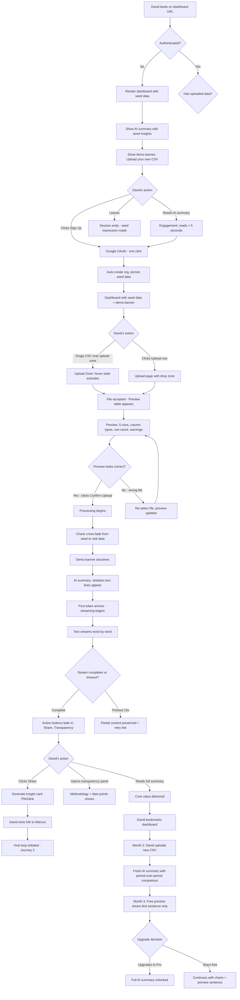
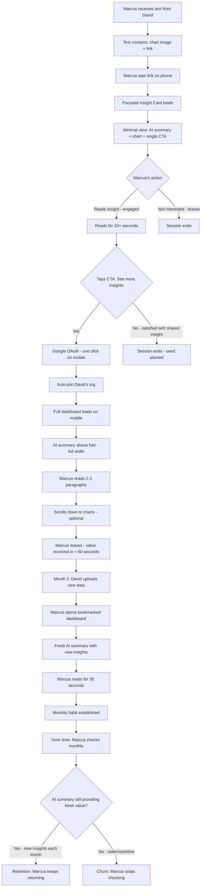
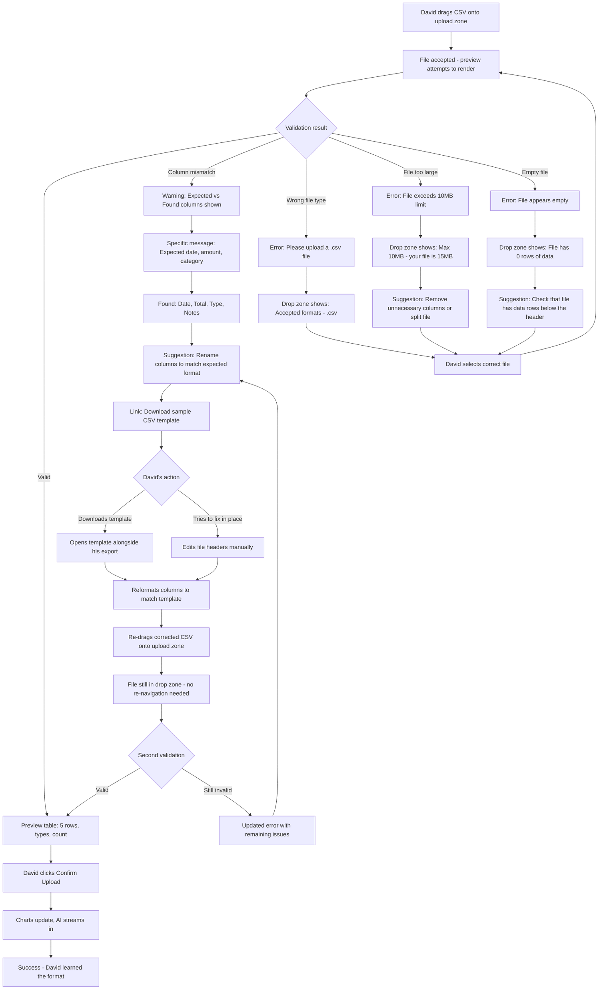
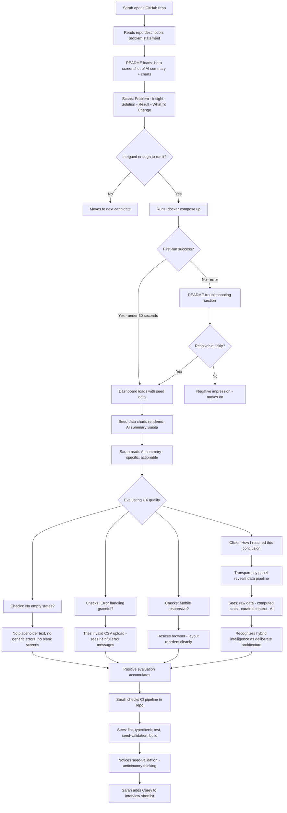

# UX Design Specification SaaS Analytics Dashboard

**Author:** Corey
**Date:** 2026-02-20

---

<!-- UX design content will be appended sequentially through collaborative workflow steps -->

## Executive Summary

### Project Vision

SaaS Analytics Dashboard transforms raw business data into plain-English AI insights for small business owners who know their data matters but can't interpret it. The product thesis — "interpretation, not just visualization" — drives every UX decision: the AI summary is the product, charts are supporting context, and the entire experience must deliver value to a non-technical user within their first session. The product also serves as a production-grade engineering portfolio piece, meaning UX polish is both a user need and a professional requirement.

### Target Users

**Marcus — The Business Owner (Mobile, Monthly)**
43-year-old landscaping business owner. Comfortable with apps, avoids spreadsheets. Checks the dashboard once a month on his phone for ~20 minutes. His entire interaction is: read the AI summary, maybe glance at a chart, act on what he learned. The AI summary must be above the fold on mobile — this is his primary (and often only) touchpoint with the product. He discovers the product through shared insights from David, not through marketing.

**David — The Operations Partner (Laptop, Weekly)**
38-year-old co-owner handling the business side. More data-comfortable but not an analyst. Checks weekly on laptop. He uploads CSVs, manages the subscription, and is the product evangelist — sharing insights that drive Marcus (and others) to sign up. David is the acquisition funnel: he discovers the product, proves its value through sharing, and triggers the viral loop.

**Hiring Manager — The Evaluator (Desktop, One Session)**
Engineering manager evaluating portfolio projects. Runs `docker compose up`, expects a working product in 60 seconds. Evaluates architecture decisions, code quality, and product polish. The UX must convey "this person ships real products" — no empty states, no placeholder text, no generic error messages.

### Key Design Challenges

1. **Dual-persona dashboard** — Marcus (mobile, AI-first, monthly) and David (laptop, data-explorer, weekly) use the same product but need different information hierarchies. Mobile reorders content with AI summary above the fold; desktop shows the full dashboard with charts and filters prominent.

2. **AI trust and transparency** — Non-technical users are skeptical of AI conclusions. The transparency panel ("How I reached this conclusion") must build confidence without introducing complexity. Progressive disclosure: summary → methodology → data points, each layer optional.

3. **Streaming interaction pattern** — SSE streaming creates a distinctive "thinking advisor" UX where text appears progressively. This requires careful handling of loading states (before first token), progress indication (during streaming), error recovery (timeout at 15s with partial results), and completion state (full summary rendered with actions available).

4. **Paywall at the value boundary** — Free users see visualization (charts, filters). Pro users see AI interpretation. The free-to-pro boundary must feel like "unlocking insight" not "hitting a wall." A preview (first sentence of AI summary) with a clear, compelling upgrade CTA.

5. **Error as education** — CSV validation failures, upload errors, and format mismatches must guide users toward success. Specific error messages ("Expected columns: date, amount, category. Found: Date, Total, Type") + downloadable sample template + preserved session state for re-upload.

6. **Demo-to-real transition** — First-time visitors see seed data with a banner. On first upload, the system transitions seamlessly: banner changes, charts update with real data, seed data is excluded. This moment — when the product becomes "theirs" — must feel smooth and rewarding.

### Design Opportunities

1. **"Aha moment" engineering** — Seed data with deliberately crafted anomalies (a cost spike, a seasonal pattern, a margin shift) ensures the AI demo summary is genuinely impressive. The first visit should make users think "I wonder what this would say about MY data" — that thought IS the conversion trigger.

2. **Focused insight card** — Shared links open a minimal, conversion-optimized view: AI summary text + chart + single CTA ("See more insights — create your free account"). This is Marcus's entry point and must be designed as a standalone micro-experience, not a stripped-down dashboard.

3. **Progressive disclosure architecture** — Three depth levels: (1) AI summary headline — the key finding in one sentence, (2) Full AI interpretation — 2-3 paragraphs with actionable advice, (3) Transparency panel — data points, computation methodology, confidence indicators. Each layer is optional; most users stop at level 1 or 2.

## Core User Experience

### Defining Experience

**The product IS the AI summary.** Everything else — uploads, charts, filters, sharing — exists to serve the moment when a non-technical business owner reads 2-3 paragraphs and understands what's happening in their business. The core experience loop is:

1. **Data enters** (CSV upload or seed data on first visit)
2. **Intelligence is computed** (local stats → curation → LLM interpretation)
3. **Insight is delivered** (streaming AI summary in plain English)
4. **User acts** (reads, shares, or makes a business decision)

The primary interaction — reading the AI summary — is passive by design. The user's job is to absorb, not to configure. The product earns trust by being right, specific, and actionable without being asked.

**The experience metaphor:** A smart business advisor explaining your numbers over coffee. Conversational tone, no jargon, no condescension. The advisor shows their work when asked (transparency panel) but doesn't lead with methodology. They surface what matters, explain why, and suggest what to do about it.

### Platform Strategy

**Web-first responsive application — no native mobile apps.**

| Context | Device | Layout Strategy | Primary Interaction |
|---------|--------|----------------|---------------------|
| Marcus monthly check-in | Phone (< 768px) | AI summary above fold, charts lazy-loaded below | Read AI summary, glance at chart, leave |
| David weekly review | Laptop (≥ 1024px) | Full dashboard — sidebar nav, charts + AI summary visible, filters accessible | Upload CSV, review charts, read AI, share insight |
| David upload session | Laptop | Upload flow — drag-drop zone, preview table, confirmation | Upload, preview, confirm, wait for AI |
| Marcus via shared link | Phone | Focused insight card — no nav, no auth, single CTA | Read shared insight, tap "See more" |
| Hiring manager evaluation | Desktop | Full dashboard with seed data | Browse, inspect, evaluate polish |

**No offline functionality required.** All value depends on server-side computation and AI generation. No PWA, no service worker caching of data.

**Touch considerations:** Upload dropzone works with tap (file picker) on mobile. Charts support pinch-to-zoom via SVG scaling. No complex gestures required — the primary mobile interaction is scrolling and reading.

### Effortless Interactions

**Zero-thought interactions (must feel invisible):**

1. **First visit → seeing value** — No signup wall. Seed data loaded. Charts rendered. AI summary visible. The visitor sees a working product before deciding anything. Time to value: < 3 seconds.

2. **Authentication** — "Sign in with Google" → one click → dashboard with demo data persisting. No email forms, no password requirements, no email verification. Auto-org creation happens silently.

3. **CSV upload** — Drag file onto clearly marked zone → preview appears (5 rows, column types, row count, any warnings) → click "Confirm Upload" → charts update → AI streams in. Four interactions: drag, review, confirm, read.

4. **AI summary delivery** — Text streams in word by word. No "click to generate" button, no configuration, no prompt input. The system decides what to analyze and how to explain it. The user's only job is to read.

5. **Demo → real data transition** — Upload CSV → seed data silently excluded → banner disappears → charts show real numbers → AI interprets real business data. No "delete demo data" step, no confirmation dialog. The transition just happens.

**Competitor friction we eliminate:**

| Competitor Pattern | Our Approach |
|-------------------|--------------|
| Connect 3-15 data sources | Upload one CSV |
| Configure dashboard layout | One pre-built dashboard |
| Learn DAX/SQL/query language | Plain English, zero input required |
| Build charts manually | Charts auto-generated from data |
| Interpret charts yourself | AI interprets for you |
| Sign up before seeing value | See value before signing up |

### Critical Success Moments

**Moment 1: First Impression (Seed Data Visit)**
*When:* Anonymous visitor lands on dashboard
*What happens:* Charts rendered with sample business data, AI summary visible with genuine insights ("Equipment rental costs increased 31% while job count remained flat")
*Success signal:* Visitor reads the AI summary for > 5 seconds
*Failure mode:* Empty dashboard, generic summary, loading spinner that doesn't resolve
*UX requirement:* Dashboard must render complete with AI summary in < 3 seconds

**Moment 2: First Upload Completion**
*When:* David drops his first CSV
*What happens:* Preview appears → confirms → charts update with HIS data → AI streams in with insights about HIS business
*Success signal:* David sees something he didn't know about his own business
*Failure mode:* CSV rejected with unhelpful error, AI summary is generic ("Your revenue has increased")
*UX requirement:* Upload-to-insight flow completes in < 20 seconds total

**Moment 3: The "Aha Moment"**
*When:* AI summary reveals a non-obvious insight
*What happens:* The AI identifies a trend, anomaly, or opportunity the user wasn't aware of. Not "revenue is up" but "fuel expenses up 15% with flat job count — investigate vendor pricing"
*Success signal:* User opens transparency panel OR shares the insight
*Failure mode:* AI states the obvious, restates numbers without interpretation
*UX requirement:* Every AI summary contains at least one non-obvious, actionable finding

**Moment 4: Share Action**
*When:* David hits "Share this insight"
*What happens:* Insight card (chart + AI summary) rendered as PNG or shareable link → David texts it to Marcus
*Success signal:* Marcus taps through and creates an account
*Failure mode:* Shared link shows full dashboard (overwhelming), share action is buried
*UX requirement:* Share button prominent after AI summary completes, shared view is a focused insight card

**Moment 5: Monthly Return**
*When:* Marcus opens the dashboard next month after David uploads new data
*What happens:* Updated AI summary with fresh insights. The AI says something NEW — not a repeat of last month
*Success signal:* Marcus reads for 10+ seconds, acts on a recommendation
*Failure mode:* Same generic summary as last month (stale insights = #1 retention killer per market research)
*UX requirement:* AI summary reflects current data and surfaces period-over-period changes

### Experience Principles

Five principles that guide every UX decision in SaaS Analytics Dashboard:

**1. Insight First, Data Second**
The AI summary is the primary content — not charts, not tables, not filters. On every screen where both appear, the AI interpretation takes visual priority. Charts support the narrative; they don't compete with it. Mobile enforces this literally (AI above fold); desktop expresses it through visual hierarchy.

**2. Show Value Before Asking for Anything**
No signup wall. No "enter your email to see a demo." Seed data loads, charts render, AI summary is visible. The visitor earns their own curiosity — "I wonder what this would say about MY data" — before the product asks for a Google sign-in. Every gate (signup, upload, upgrade) comes after demonstrated value, never before.

**3. Earn Trust Through Transparency**
AI conclusions feel authoritative because users can verify them. The transparency panel ("How I reached this conclusion") is always one click away — never forced, never hidden. The product says "here's what I found" and offers "here's how I found it." Trust is built incrementally: accurate insight → optional methodology → full data lineage.

**4. Guide, Don't Block**
Errors educate rather than punish. A CSV format mismatch doesn't say "Upload failed" — it says "Expected columns: date, amount, category. Found: Date, Total, Type" with a link to download the template. Every dead end has a clear path forward. The product assumes good intent and helps the user succeed.

**5. Simple by Default, Deep on Demand**
The surface is radically simple: upload, see, read. But depth exists for those who want it. David can explore charts, filter by date range, open the transparency panel. Marcus never needs to — he reads the summary and leaves. The product adapts to engagement level without requiring configuration.

## Desired Emotional Response

### Primary Emotional Goals

The emotional core of SaaS Analytics Dashboard is transforming how small business owners feel about their own data — from anxiety and avoidance to confidence and control.

| Current State | Desired State | Design Lever |
|--------------|---------------|--------------|
| "I know my numbers matter but I can't read them" | **Confidence** — "I understand what's happening in my business" | AI summary in plain English, no jargon, actionable language |
| "Data tools are for analysts, not me" | **Relief** — "Finally, something that speaks my language" | Zero-configuration experience, no query builders, no chart customization |
| "I don't trust AI to understand my business" | **Trust** — "This thing actually gets it" | Transparency panel, specific insights (not generic), data lineage on demand |

**The emotional transformation in one sentence:** From "I should probably look at my numbers but I don't know how" to "I already know what's happening — let me decide what to do about it."

### Emotional Journey Mapping

**Stage 1: Discovery (Anonymous Visit)**
*Target emotion:* Curiosity + Intrigue
The visitor sees seed data insights and thinks "I wonder what this would say about MY data." The product must feel immediately credible — real insights about real-looking business data, not placeholder text. The emotion is the same as watching someone else get a great haircut: "I want that for me."

**Stage 2: First Upload**
*Target emotion:* Anticipation + Mild Excitement
David drags his CSV and sees the preview table. The emotion should be "let's see what this finds" — the upload process builds anticipation naturally through the streaming response. The skeleton loading state and progressive text rendering create a "the advisor is thinking" moment.

**Stage 3: The Aha Moment**
*Target emotion:* Surprise + Validation
The AI reveals something non-obvious. "Fuel expenses up 15% with flat job count — investigate vendor pricing." The surprise is genuine discovery; the validation is "I always suspected something was off but couldn't articulate it." This is the peak emotional moment and the conversion trigger.

**Stage 4: Sharing**
*Target emotion:* Pride + Generosity
David shares an insight with Marcus not because the product asks him to, but because the insight is genuinely worth sharing. The emotion is "look what I found" — a mix of pride in discovery and generosity in sharing something useful. The focused insight card must feel like a gift, not a sales pitch.

**Stage 5: Error or Failure**
*Target emotion:* Guided Determination (not frustration)
When a CSV upload fails or formatting is wrong, the user should feel "okay, I can fix this" not "this tool doesn't work." Specific error messages + downloadable template + preserved session state transform potential frustration into a solvable puzzle. The product takes blame ("We expected columns named...") rather than pointing fingers ("Your file is wrong").

**Stage 6: Return Visit**
*Target emotion:* Familiar Comfort + Fresh Discovery
Marcus returns next month and the dashboard feels like a known space (familiar layout, same advisor tone) but with new information. The emotion is like opening a favorite news app — comfortable routine with fresh content. Stale insights are the #1 emotional killer; every return must offer something new.

**Stage 7: Upgrade Decision**
*Target emotion:* Fair Exchange (not pressure)
The free-to-pro boundary should feel like "this is worth paying for" not "I'm being locked out." The first sentence of the AI summary visible for free + a clear, honest CTA creates a sense of fair value exchange. The emotion is consent, not coercion.

### Micro-Emotions

**Confidence vs. Confusion** *(Critical)*
Every element must reinforce "you're in the right place, doing the right thing." Visual hierarchy guides the eye. AI summaries use familiar language. No unexplained acronyms, no unmarked buttons, no ambiguous icons. When confusion occurs (and it will), the product provides immediate context — tooltips, inline explanations, helpful error states.

**Trust vs. Skepticism** *(Critical)*
AI-generated content triggers natural skepticism. The transparency panel exists specifically to convert skeptics: "Here's what I found → here's how I found it → here's the data I used." Trust builds across sessions — the first accurate insight earns a sliver of trust, the third earns habitual reliance. Never overstate confidence; hedge when data is limited.

**Accomplishment vs. Frustration** *(Important)*
Every completed action should feel like a small win. Upload confirmed: checkmark + "Processing your data..." First insight loaded: the text appears. Share sent: confirmation with preview. Frustration is prevented by never leaving the user in a dead end — every error has a clear next step.

**Delight vs. Satisfaction** *(Aspirational)*
Satisfaction is the baseline — the product does what it promises. Delight is the stretch goal — the product surprises with unexpected value. The streaming text animation, the specificity of AI insights, the seamless demo-to-real transition — these are delight opportunities. But delight never comes at the cost of reliability. A delightful animation that masks a 10-second delay is not delight; it's decoration.

### Design Implications

| Desired Emotion | UX Approach | Specific Implementation |
|----------------|-------------|------------------------|
| Confidence | Clear visual hierarchy, familiar patterns | AI summary as primary content, charts as supporting context, consistent layout |
| Relief | Radical simplicity, zero configuration | One-page dashboard, no settings menu, no customization options for MVP |
| Trust | Progressive transparency, verifiable claims | "How I reached this conclusion" panel, specific numbers cited, data lineage |
| Curiosity | Seed data quality, non-obvious insights | Deliberately crafted anomalies in demo data, insights that provoke "what about MY data?" |
| Guided Determination | Educative errors, preserved state | Specific error messages with fix instructions, downloadable CSV template, no data loss on failure |
| Fair Exchange | Honest paywall, visible value | First sentence preview for free users, clear Pro value proposition, no dark patterns |

### Emotional Design Principles

**1. Never Make the User Feel Stupid**
The product's entire value proposition is explaining complex data in simple terms. If a user feels confused, the product has failed — not the user. Language is conversational, not condescending. Error messages blame the system, not the user. The transparency panel exists for those who want depth, not as proof of intelligence.

**2. Earn Emotional Investment Gradually**
First visit: curiosity. First upload: anticipation. First insight: surprise. First share: pride. Each emotional stage builds on the last. The product never demands emotional commitment upfront (no "Tell us about your business!" onboarding). It earns attention by delivering value, then earns trust by being consistently accurate.

**3. Make AI Feel Human, Not Robotic**
The "advisor over coffee" metaphor extends to emotional design. The AI summary reads like a person talking, not a report generating. "Your fuel costs jumped 15% — worth checking if your vendor raised prices" feels human. "A 15% increase in fuel expenditure was detected in the analyzed period" feels robotic. Tone matters as much as content.

**4. Transform Negative Moments into Recovery Stories**
Every error, failure, or dead end is an opportunity to demonstrate care. A CSV rejection becomes "Here's exactly what we need and a template to help." A timeout becomes "We saved what we found so far — the full analysis will be ready shortly." The emotional trajectory is: problem → clear guidance → successful resolution → relief.

**5. Reward Returning Users with Fresh Value**
The most dangerous emotional state is indifference — "I already saw this." Every return visit must offer something the user hasn't seen before. Period-over-period comparisons, newly detected trends, seasonal pattern alerts. The product should feel alive and attentive, not static and repetitive. Returning users should feel recognized, not ignored.

## UX Pattern Analysis & Inspiration

### Inspiring Products Analysis

**Mint / Copilot — Financial Summary for Non-Analysts**

| Aspect | What They Do Well | What We Learn |
|--------|-------------------|---------------|
| Data presentation | Auto-categorized spending, trend arrows, period comparison | Auto-generated charts from CSV data; period-over-period comparison in AI summary |
| Mobile experience | Summary cards above fold, swipeable categories | AI summary card as primary mobile content, charts lazy-loaded below |
| Onboarding | Connect bank → see dashboard immediately | Upload CSV → see dashboard immediately (even faster: seed data on first visit) |
| Weakness | Users still must interpret the numbers themselves | AI interprets FOR the user — this is our differentiator |
| Error handling | Graceful bank sync failure with "Last updated 2 hours ago" badge; retry without data loss; partial data displayed while sync recovers | Stale-data indicator ("Last upload: Jan 15") rather than hiding the dashboard during issues; always show the last-known-good state |

**Superhuman / Linear — Streaming & Focus**

| Aspect | What They Do Well | What We Learn |
|--------|-------------------|---------------|
| Progressive loading | Content appears incrementally, feels responsive | SSE streaming text creates "advisor is thinking" moment — builds anticipation |
| Information density | Minimal chrome, content fills the viewport | Dashboard should be content-dense (charts + AI summary), not chrome-heavy |
| Keyboard/power users | Depth exists for those who want it | Transparency panel and date filters for David; invisible to Marcus |
| Weakness | Steep learning curve for power features | We avoid this by having zero power features in MVP — depth is read-only |
| Error handling | Optimistic UI with background retry; failed operations surface as non-blocking banners; undo available for 5 seconds | Non-blocking error patterns for upload failures — never replace the dashboard with an error screen. Errors appear as banners, not pages |

**Morning Brew / The Skimm — Expert Translation**

| Aspect | What They Do Well | What We Learn |
|--------|-------------------|---------------|
| Tone | Conversational, confident, occasionally witty | AI summary voice: advisor over coffee, not analyst presenting findings |
| Structure | Headline → context → "why it matters" | AI summary: key finding → explanation → actionable recommendation |
| Engagement | Fresh content daily keeps users returning | Fresh insights per upload; period-over-period changes prevent staleness |
| Weakness | One-size-fits-all content, no personalization | AI summary is inherently personalized — it's about YOUR business data |
| Error handling | Cached content always available; loading failures show last edition; "Pull to refresh" for recovery | If AI generation fails, show last AI summary with "Updated insights are being prepared" — never show an empty insight card |

**ChatGPT / Claude — AI-Generated Text UX**

| Aspect | What They Do Well | What We Learn |
|--------|-------------------|---------------|
| Streaming text | Progressive word-by-word rendering with cursor blink; content IS the loading indicator | Our SSE streaming should feel familiar — users trained by ChatGPT expect progressive text reveal, not a spinner followed by a wall of text |
| Trust & transparency | ChatGPT shows reasoning steps; Perplexity cites sources inline; Claude hedges when uncertain ("I'm not sure, but...") | Transparency panel should borrow source-citation patterns (Perplexity) and confidence hedging (Claude). Never overstate certainty — "likely" and "worth investigating" build more trust than definitive claims |
| Response actions | Copy button appears on completion; share, regenerate, and edit prompt affordances are contextual | Share and transparency panel links should appear after streaming completes, not during. Post-completion is the action moment |
| Error handling | Partial responses preserved on timeout; "network error" with retry button; graceful degradation to "try again" | Our 15s timeout should show partial results (the architecture already specifies this) with a clear "Full analysis took longer than expected — here's what we found so far" message |
| Weakness | Chat paradigm assumes user knows what to ask; requires prompt engineering skill | Our product eliminates the prompt entirely — the AI decides what to analyze. This is the core differentiator: zero-input intelligence vs. chat-based Q&A |

**QuickBooks Dashboard — SMB Financial Mental Model**

| Aspect | What They Do Well | What We Learn |
|--------|-------------------|---------------|
| Summary cards | Revenue, expenses, profit/loss as large-number cards at top; instant orientation | David's mental model of "dashboard" is formed here. Our charts should use familiar financial categories (revenue, expenses, trends) — don't invent new terminology |
| Period comparison | "vs. last month" and "vs. same period last year" built into every metric; trend arrows (↑↓) | Period-over-period comparison should feel native, not novel. Green up-arrow for positive, red down-arrow for concern — same visual language David already knows |
| Category breakdowns | Pie/bar charts for expense categories; drill-down into transactions | Our auto-generated charts should default to category breakdowns (the most useful view for SMBs) rather than time series (which analysts prefer but SMBs find less actionable) |
| Mobile app | Simplified view with summary metrics and recent transactions; notification-driven engagement | David checks QuickBooks mobile for quick status. Our mobile experience should feel like a smarter, simpler version of what he already uses — not a foreign app |
| Weakness | Presents numbers without interpretation; assumes user can derive meaning from charts | This IS our opportunity. QuickBooks says "Fuel: $4,200 (↑15%)." We say "Fuel costs jumped 15% while job count stayed flat — check if your vendor raised prices." Same data, different value |

### Transferable UX Patterns

**Navigation Patterns:**
- **Single-page dashboard** (Mint/Copilot) — No multi-page navigation for the core experience. The dashboard IS the product. Sidebar navigation limited to: Dashboard, Upload, Settings/Account. Marcus never navigates; David navigates to upload then returns.
- **Content-first mobile layout** (Morning Brew) — On mobile, the AI summary occupies the full viewport initially. Charts appear on scroll. No hamburger menu needed for Marcus's use case.

**Interaction Patterns:**
- **Streaming text delivery** (Superhuman/Linear) — Text appears word-by-word during SSE streaming. No spinner with "Generating insights..." — the content itself is the loading indicator. Skeleton text lines before first token, then progressive reveal.
- **Zero-configuration intelligence** (Copilot) — The system decides what to analyze. No "select metrics" step, no "choose chart type" dialog. Upload data → receive interpretation. The product's intelligence is in curation, not configuration.
- **Drag-and-drop with preview** (Linear file attachments) — CSV upload uses drag-drop with immediate preview table (5 rows, column types, row count). Confirmation step before processing. File picker fallback for mobile tap.

**Visual Patterns:**
- **Card-based content hierarchy** (Mint) — AI summary in a primary card, charts in secondary cards. Visual weight communicates importance. The AI card is larger, higher, and more prominent than chart cards.
- **Confident, sparse typography** (Linear) — Large, readable type for the AI summary. No competing visual elements. Generous whitespace. The text IS the interface.
- **Contextual color** (Copilot) — Green for positive trends, amber for warnings, red for concerns. Applied to AI summary keywords and chart elements. Color reinforces meaning without requiring legend interpretation.

**AI Trust & Transparency Patterns:**
- **Progressive confidence disclosure** (Perplexity/Claude) — Surface-level: confident summary statement. One click deeper: methodology ("I compared your Q3 expenses against Q2 and found..."). Deepest layer: specific data points used. Each layer is optional; most users never go past level 1. Maps directly to the transparency panel (FR20).
- **Confidence hedging in language** (Claude) — "Your fuel costs appear to have increased" vs. "Your fuel costs increased." Hedging when data is limited (small sample, single period) builds trust. Definitive language when data is strong (multi-period trends, large datasets) conveys authority. The AI's tone should calibrate to data confidence.
- **Inline source indicators** (Perplexity) — Small, non-intrusive markers that data points are backed by real numbers. Not footnotes or citations — subtle signals like "based on 847 transactions" or "comparing Jan-Mar vs Apr-Jun" woven into the summary text.

**Streaming Interaction State Patterns:**
- **Pre-stream state** (ChatGPT) — Before the first token arrives (TTFT target: < 2s per architecture), show 3-4 skeleton text lines that pulse/shimmer. Include a subtle "Analyzing your data..." label. The skeleton should match the approximate shape of a real AI summary — not generic rectangles, but text-line-shaped placeholders with varied widths.
- **Mid-stream behavior** (ChatGPT) — Text renders progressively. The viewport auto-scrolls to follow new text UNLESS the user has scrolled up (reading earlier content). A "↓ New content below" indicator appears if the user has scrolled away from the streaming edge. Share/transparency actions are NOT available during streaming — they appear on completion.
- **Stream completion** (Superhuman) — A subtle transition marks "done": the cursor blink stops, action buttons (Share, "How I reached this conclusion") fade in, and the full summary is available for selection/copy. No jarring "Generation complete!" banner — the completion should feel natural, like an advisor finishing their thought.
- **Error mid-stream** (ChatGPT) — If streaming fails partway (timeout at 15s per NFR18), preserve everything received. Show a soft boundary: "— Full analysis is still processing. Here's what we've found so far —" followed by the partial content. Include a non-blocking "Retry full analysis" link. Never discard partial results.
- **Timeout experience** — The 15s limit (NFR3) should feel like a graceful conclusion, not an error. "We focused on the most important findings to keep things quick" reframes a timeout as intentional curation. The partial result IS valuable — present it as such.

**Data Upload & Validation Patterns:**
- **Drag-drop with state feedback** (Dropbox/WeTransfer) — The drop zone changes state clearly: default (dashed border, "Drop your CSV here or click to browse"), hover (solid border, background color shift, "Drop to upload"), processing (progress bar or spinner within the zone). On mobile, the zone becomes a tap target that opens the file picker directly — no drag-drop pretense on touch devices.
- **Preview table as confirmation** (Google Sheets import) — Show 5 representative rows with detected column types (date, currency, text) as colored badges. Display total row count ("2,847 rows detected") and any warnings ("3 rows have missing 'amount' values — they'll be skipped"). The preview IS the validation — users confirm the data looks right before processing begins.
- **Validation errors as guidance** (Stripe API errors) — Never say "Invalid file." Say "We expected columns named date, amount, and category. Your file has columns named Date, Total, and Type — would these be the same?" Provide a downloadable sample CSV template as a fallback. Preserve the attempted upload in the dropzone so users don't need to re-select the file after fixing issues.
- **Post-upload transition** (WeTransfer completion) — The moment upload + processing completes is the emotional climax. Charts should update with a brief, smooth transition (not a hard refresh). The AI streaming begins immediately — no "Your data is ready, click to generate insights" intermediate step. Upload → charts update → AI streams in. Three beats, no pauses.

**Sharing & Viral Loop Patterns:**
- **Share card as standalone micro-experience** (Twitter/X card previews, Spotify Wrapped) — The shared insight link doesn't open a stripped-down dashboard. It opens a purpose-built card: AI summary excerpt, one supporting chart, and a single CTA ("See more insights — create your free account"). This card must work as an Open Graph preview in iMessage/WhatsApp — the image, title, and description must be compelling at thumbnail size.
- **Share action timing** (any social product) — The "Share this insight" button appears after the AI summary finishes streaming, positioned prominently below the summary. Not buried in a menu. Not available during streaming (the insight isn't complete yet). The button should feel like a natural next step: "I just learned something — I want to share this."
- **Link preview optimization** (Slack unfurling, iMessage previews) — The focused insight card URL must include proper Open Graph meta tags: og:title (the key finding in < 60 chars), og:description (first sentence of AI summary), og:image (auto-generated chart snapshot as PNG). Marcus will see this as an iMessage bubble before he taps — it must be compelling at that size.

**Demo-to-Real Transition Patterns:**
- **Banner-driven demo mode** (Figma/Canva templates) — A persistent but non-intrusive banner: "You're viewing sample data — upload your own CSV to see insights about YOUR business." The banner is informational, not a nag. It disappears permanently on first real data upload — no "dismiss" button needed because the state change IS the dismissal.
- **Seamless content swap** (Notion templates) — When David uploads his first CSV, the transition should feel like the product "waking up" to his business: charts animate from seed data to real data (cross-fade, not hard swap), the AI summary regenerates with his actual numbers, and the demo banner dissolves. This 3-5 second transition is the "it's mine now" moment — it should feel smooth and rewarding, not jarring.
- **No explicit "delete demo data" step** — The architecture's 4-state demo mode machine (seed_only → seed_plus_user → user_only) handles this automatically. The user never sees a "Remove sample data?" dialog. The seed data simply stops appearing once real data exists. Simplicity through state management, not through UI prompts.

### Anti-Patterns to Avoid

**1. Dashboard Builder Syndrome** (Tableau, Power BI)
Configurable dashboards assume users know what they want to see. Our users don't — that's the entire point. One fixed layout, optimized for the most common use case, with responsive reordering for mobile. No drag-to-rearrange, no widget library, no "add chart" button.

**2. Data Source Connection Maze** (most analytics tools)
Multi-step OAuth flows, API key management, data source configuration — these are analyst workflows, not SMB workflows. One input method (CSV upload), one confirmation step, done. Growth-tier API integrations (if added later) should feel equally simple.

**3. Generic AI Responses** ("Your revenue increased")
The #1 trust killer. If the AI summary reads like it could apply to any business, it fails. Every insight must reference specific numbers, specific categories, specific time periods from the user's actual data. "Revenue increased" is unacceptable; "Revenue from residential jobs up 23% in Q3, driven by 4 new recurring contracts" earns trust.

**4. Feature-Gating That Feels Punitive** (many SaaS products)
Disabled buttons, grayed-out sections, "Upgrade to unlock" overlays on every feature. Our paywall is surgical: free users see charts and visualization, Pro users see AI interpretation. The boundary is one clear line, not scattered locks across the interface.

**5. Onboarding Questionnaires** ("Tell us about your business")
Multi-step onboarding forms before showing value. Our product shows value before asking for anything — not even a name. Seed data delivers immediate proof of concept. Sign-up happens after curiosity is earned.

**6. Information Overload on First Visit** (enterprise analytics)
Showing every feature, every option, every metric on the first screen. Our first visit shows: seed data charts + AI summary + "Upload your own data" CTA. Three things. The product reveals depth over time, not all at once.

**7. AI Chat Interface Syndrome** (ChatGPT, every AI product in 2026)
The default AI UX in 2026 is a chat input box: "Ask me anything." Our product deliberately rejects this paradigm. The AI summary is a monologue — the system decides what to analyze and how to explain it. There is no prompt input, no "ask a follow-up question" affordance, no conversation history. Users trained by ChatGPT will expect a text input; its absence must feel intentional, not incomplete. The dashboard layout, the auto-generated nature of the summary, and the lack of an input field all communicate: "We already know what to tell you." The PRD defers "ask-the-data" to post-MVP deliberately — for MVP, the product's intelligence is in curation, not conversation.

**8. Wall of Numbers Dashboard** (traditional KPI dashboards)
Grids of KPI cards — revenue, expenses, profit, margin, growth rate — presented as raw numbers in boxes. This pattern assumes the user can synthesize meaning from 8-12 numbers simultaneously. Our users can't, and that's not a failing — it's the reason the product exists. Instead of 8 KPI cards, we have one AI summary that synthesizes all metrics into a narrative. Charts provide visual context for the narrative; they don't replace it. If a hiring manager sees a KPI card grid, they'll think "another dashboard template." If they see an AI summary with supporting charts, they'll think "this person understood the problem."

**9. AI Loading Spinner** (most AI-powered products)
A generic spinner or "Thinking..." message displayed for 5-15 seconds while AI generates a response, followed by the entire response appearing at once. This creates two problems: dead time where the user has nothing to engage with, and a jarring wall-of-text arrival. Our streaming approach eliminates both — the content IS the loading indicator. Text appears progressively, creating a "the advisor is formulating their thoughts" experience. The skeleton-to-streaming transition means the user is never staring at nothing. If you find yourself designing a spinner for the AI summary, something has gone wrong.

### Design Inspiration Strategy

**What to Adopt Directly:**
- **Streaming text as primary loading pattern** — from Superhuman/Linear. The SSE streaming AI summary creates engagement through progressive reveal. No separate loading state needed.
- **Summary-first mobile layout** — from Morning Brew/newsletter apps. AI summary above fold on mobile, everything else below the scroll line.
- **Conversational expert tone** — from The Skimm/Morning Brew. "Here's what I found, here's why it matters, here's what to do." Confident, specific, never condescending.
- **AI confidence hedging** — from Claude. Calibrate summary language to data confidence. "Your fuel costs appear elevated" (limited data) vs. "Fuel costs increased 15% across all three quarters" (strong data). Trust is built through honest calibration, not through false confidence.
- **Post-completion action reveal** — from ChatGPT. Share button and transparency panel link appear only after streaming completes. During streaming, the summary is still forming; actions on incomplete content create confusion.

**What to Adapt:**
- **Financial dashboard cards** — from Mint/Copilot. Adapt the card-based layout but invert the hierarchy: AI summary card is primary (largest, top position), chart cards are secondary. Mint puts charts first; we put interpretation first.
- **Progressive disclosure** — from Linear. Adapt their "simple surface, deep on demand" pattern but apply it to AI transparency rather than project management features. Default = summary, one click = methodology, another click = data points.
- **Period-over-period comparison** — from Copilot. Adapt their "vs. last month" comparisons but deliver them as AI narrative ("Fuel costs up 15% from last month") rather than as chart annotations.
- **Source citation from Perplexity** — Adapt inline source indicators, but instead of URLs, cite data points: "based on 847 transactions" or "comparing Q2 vs Q3." The transparency panel provides the deep citation; the summary provides lightweight anchors.
- **Drag-drop upload from Dropbox/WeTransfer** — Adapt the stateful drop zone (default → hover → processing → complete) but compress the post-upload flow: no separate "processing" page. Upload confirmation transitions directly to chart update and AI streaming in one continuous flow.
- **Share card from Spotify Wrapped** — Adapt the standalone shareable card concept, but design for iMessage/WhatsApp preview rendering rather than Instagram Stories. The card must be compelling at thumbnail size in a text message bubble.
- **Demo banner from Figma/Canva** — Adapt the template-mode indicator, but make it dissolve automatically on first real upload rather than requiring manual dismissal. The state change is the signal.

**What to Avoid:**
- **Customizable dashboards** — conflicts with "zero configuration" principle. Fixed layout, responsive breakpoints.
- **Multi-step onboarding** — conflicts with "show value before asking" principle. No forms before value.
- **Feature discovery tours** — conflicts with simplicity. If the product needs a tour, the product is too complex. Three actions: upload, read, share. Each should be self-evident.
- **Gamification or badges** — conflicts with professional tone. This is a business tool, not a habit tracker. Value retention comes from fresh insights, not streak counters.
- **Chat input boxes** — No "Ask about your data" text input in MVP. The AI decides what matters. Users who want to ask questions are future-state users; MVP users want answers delivered, not questions accepted.
- **KPI card grids as primary content** — No grid of 8+ metric cards above the AI summary. Numbers support the narrative; they don't precede it.
- **Loading spinners for AI generation** — No "Generating insights..." spinner. Streaming text IS the loading experience. If there's a gap before the first token (TTFT), use skeleton text lines, not a spinner.

## Design System Foundation

### Design System Choice

**shadcn/ui + Tailwind CSS v4** — A themeable, copy-paste component library built on Radix UI accessibility primitives, styled with Tailwind CSS utility classes.

This is not a traditional dependency. shadcn/ui components are copied into the project's source code via CLI (`npx shadcn add [component]`), becoming owned code — editable, inspectable, and fully customizable. The project depends on Tailwind CSS v4 and Radix UI primitives at runtime, but the component implementations live in the codebase, not in `node_modules`.

### Rationale for Selection

| Factor | How shadcn/ui + Tailwind v4 Fits |
|--------|----------------------------------|
| **Next.js 16 + React 19.2 alignment** | shadcn/ui runs on Next.js 15.3+ with Tailwind v4 as of May 2025. Full RSC (React Server Components) support. Tailwind v4 uses `@tailwindcss/postcss` — zero-runtime, Turbopack-friendly. |
| **Solo developer speed** | Pre-built components for every UI element this project needs: Card, Dialog, DropdownMenu, Skeleton, Tooltip, Sheet, Badge, Button, Separator. Install in seconds, customize immediately. No building from scratch. |
| **Portfolio signal** | Components live in the codebase as owned code. Hiring managers reviewing the repo see thoughtful component customization, not opaque library imports. The code says "I chose good foundations and tailored them" — not "I installed a framework." |
| **Accessibility built-in** | Radix UI primitives provide ARIA attributes, keyboard navigation, focus management, and screen reader support. Meets NFR24-27 (semantic HTML, keyboard navigation, not color-only, axe-core zero critical) without additional effort. Full WCAG 2.1 AA compliance will be verified with contrast tooling during implementation. |
| **Theming via CSS variables** | Design tokens (colors, spacing, radii, fonts) defined as CSS custom properties in `globals.css`. Dark mode supported via `next-themes`. Customization happens in CSS, not in JS config objects. |
| **Tailwind v4 CSS-first config** | Theme values defined directly in CSS with `@theme`. Minimal `tailwind.config.ts` retained for build tool integration (content paths for Turbopack). PostCSS plugin via `@tailwindcss/postcss`. |
| **Chart compatibility** | Recharts composes cleanly alongside Tailwind-styled components. shadcn/ui includes a Chart component wrapping Recharts with theme-aware styling. |
| **Performance** | Zero CSS-in-JS runtime. Tailwind generates only the utility classes actually used. Tree-shaking is automatic since components are source code, not library exports. |

**Alternatives considered:**

| Alternative | Why Not |
|-------------|---------|
| **Mantine** | 100+ components is overkill for this product's intentionally minimal UI. Adds ~45KB to bundle. Components are dependency imports, not owned code — less impressive in portfolio review. |
| **Chakra UI** | Strong theming API but v3 migration is still stabilizing. CSS-in-JS runtime adds overhead. Smaller ecosystem than shadcn/ui in the Next.js community. |
| **Material UI (MUI)** | "Looks like a Google app" — the Material Design aesthetic signals "internal tool" not "product." Heavy dependency. Hiring managers associate MUI with default-template projects. |
| **Custom from scratch** | Weeks of component work before any feature can be built. Accessibility would need manual implementation. Overkill for a solo developer building an MVP. |

### Implementation Approach

**Installation:**
- Tailwind CSS v4 via `@tailwindcss/postcss` in `postcss.config.mjs`
- shadcn/ui initialized with `npx shadcn init` — generates `components.json` and base utilities
- Components added individually: `npx shadcn add card skeleton button dialog badge tooltip separator dropdown-menu sheet`
- Theme provider via `next-themes` for dark mode support
- Icon library: Lucide React (tree-shakeable, default with shadcn/ui)
- Font loading: Inter via `next/font/google` in root `layout.tsx` — eliminates FOUT, self-hosted by Next.js at build time

**Component location:**
- `apps/web/components/ui/` — shadcn/ui base components (Button, Card, Skeleton, etc.)
- `apps/web/components/` — project-specific compositions (AISummaryCard, ChartGrid, UploadZone, TransparencyPanel)
- Follows the architecture's file map: compositions import from `ui/`, never the reverse

**Design tokens in CSS:**
```css
@theme {
  --color-primary: oklch(0.55 0.15 250);    /* Trust blue */
  --color-success: oklch(0.65 0.18 145);    /* Positive trends */
  --color-warning: oklch(0.75 0.15 85);     /* Attention amber */
  --color-destructive: oklch(0.55 0.2 25);  /* Concerns red */
  --radius-lg: 0.75rem;                      /* Card corners */
  --radius-md: 0.5rem;                       /* Button corners */
  --font-sans: 'Inter', system-ui, sans-serif;
}
```

### Customization Strategy

**What stays default:**
- Radix UI accessibility primitives (ARIA, keyboard nav, focus trapping) — don't reinvent accessibility
- Component composition patterns (Slot, forwardRef, className merging via `cn()`)
- Tailwind utility class approach — no custom CSS unless absolutely necessary

**What gets customized:**
- **Color palette** — Replace default slate/zinc with a warm, approachable palette that matches the "advisor over coffee" tone. Blues for trust, greens for positive, ambers for caution — aligned with the contextual color pattern from Step 5.
- **Typography scale** — Larger body text (16px minimum) and generous line-height (1.6) for the AI summary. The text IS the product; it must be effortlessly readable on both mobile and desktop.
- **Card component** — The AI summary card gets a distinctive visual treatment: slightly elevated, wider padding, optional subtle left-border accent. Chart cards are visually subordinate — smaller, flatter, grouped. This implements the "card-based content hierarchy" pattern.
- **Skeleton component** — Custom text-line skeletons with varied widths for the pre-stream AI summary state. The default shadcn Skeleton is generic rectangles; ours mimic the shape of real text paragraphs.
- **Dark mode** — Full dark mode support via CSS variables and `next-themes`. Not a priority for MVP launch but the foundation is in place from day one. Toggled via a button in the settings area.

**What gets built from scratch (not in shadcn/ui):**
- **AISummaryCard** — Streaming text renderer with skeleton → stream → complete states. Wraps shadcn Card with SSE-aware logic.
- **TransparencyPanel** — Progressive disclosure component (summary → methodology → data points). Built on shadcn Sheet or Collapsible.
- **UploadZone** — Drag-drop CSV upload with state feedback (default → hover → processing → complete). File picker fallback for mobile.
- **ChartGrid** — Responsive chart layout using Recharts, styled with Tailwind, respecting the card hierarchy.
- **InsightShareCard** — Focused view for shared links with Open Graph meta tag support.
- **DemoBanner** — Dismissable (via state, not user action) banner for seed data mode.

## Defining Core Experience

### Defining Experience

**"Upload your data, read what it means."**

The defining experience is the moment between CSV upload and reading the AI summary — when raw business data transforms into plain-English insight. Every other interaction (authentication, sharing, transparency panel, date filters) is support structure for this core moment.

The one-sentence elevator pitch: *"I dropped a spreadsheet and it told me my fuel costs are up 15% because my vendor raised prices — something I'd never have caught in QuickBooks."*

**Tinder-test equivalent:** Tinder = "Swipe right to match." SaaS Analytics Dashboard = "Drop a file, read what matters."

### User Mental Model

**How users currently solve this problem:**
David exports CSVs from QuickBooks or Square. He opens them in Excel or Google Sheets. He sorts columns, makes a chart or two, and tries to spot trends. This takes 30-60 minutes and produces uncertain conclusions. Marcus doesn't do any of this — he relies on David to summarize verbally, which is imprecise and sporadic.

**Mental model they bring:**
- David thinks "upload file → see results" (like attaching a document to an email — drop, done)
- Marcus thinks "open app → read update" (like checking a news app — tap, read, leave)
- Neither thinks "configure dashboard → build charts → interpret data" — that's an analyst mental model

**Where confusion could occur:**
- CSV format requirements (what columns? what date format?) — mitigated by the sample template download and guidance-first error messages
- Expecting a chat interface (ChatGPT mental model) — mitigated by the deliberate absence of an input box and the auto-generated nature of the summary
- Expecting instant results (not understanding why streaming takes 5-15 seconds) — mitigated by the streaming text that creates visible progress from the first token
- Not understanding the free/Pro boundary — mitigated by the preview (first sentence visible) + clear CTA

### Success Criteria

| Criterion | Metric | Rationale |
|-----------|--------|-----------|
| **Time to first value** | < 3 seconds (seed data); < 20 seconds (first upload to insight) | If a visitor waits longer than 3 seconds before seeing value, they leave. If David waits longer than 20 seconds from upload to AI insight, the magic breaks. |
| **Insight specificity** | Every AI summary references ≥ 3 specific data points from the user's actual data | Generic summaries ("revenue is up") destroy trust. Specific summaries ("residential revenue up 23% in Q3, driven by 4 new recurring contracts") build it. |
| **Comprehension without effort** | 0 clicks required to receive the primary insight | The AI summary is visible, streaming, and readable without any user action after upload. No "generate," no "analyze," no "show insights" button. |
| **Actionability** | Every AI summary includes ≥ 1 concrete recommendation | "Fuel costs up 15%" is observation. "Fuel costs up 15% — worth checking if your vendor raised prices" is actionable. The product's value is in the recommendation, not the observation. |
| **Return value** | Each new upload produces meaningfully different insights from the previous one | Stale, repetitive summaries are the #1 retention killer (market research). Period-over-period comparison ensures returning users see something new. |
| **Share-worthiness** | The insight is specific and valuable enough that David would text it to Marcus | If David wouldn't share it, the insight isn't good enough. The viral loop depends on share-worthy AI output. |

### Novel vs. Established Pattern Analysis

**This product combines established patterns in a novel arrangement:**

| Aspect | Pattern Type | What We Use |
|--------|-------------|-------------|
| **File upload** | Established | Drag-drop with preview (Dropbox/WeTransfer pattern). Users know this interaction — zero learning curve. |
| **Dashboard layout** | Established | Card-based hierarchy (Mint/Copilot pattern). Familiar financial dashboard structure — David recognizes it immediately. |
| **AI streaming text** | Established (2024+) | Progressive text rendering (ChatGPT pattern). Users now expect this from AI products — it's a baseline, not innovation. |
| **AI as primary content** | Novel arrangement | Most products use AI as an assistant (chat) or enhancement (suggestions). We use AI as THE product — the summary IS the dashboard. Charts support the narrative; they don't lead. This inversion of the typical dashboard hierarchy is our UX innovation. |
| **Zero-input intelligence** | Novel arrangement | Most AI products require a prompt. Ours requires nothing — the system decides what to analyze. This feels like magic when it works ("how did it know to look at fuel costs?") and like a limitation when it doesn't ("but I wanted to know about payroll"). The PRD defers "ask-the-data" to post-MVP deliberately. |
| **Transparency on demand** | Novel application | Perplexity pioneered inline citations for AI. We adapt this for business analytics — not "Source: Wikipedia" but "Based on 847 transactions, comparing Q2 vs Q3." The transparency panel is a novel application of an emerging pattern. |

**No user education needed.** Every individual interaction (upload, read, share) uses familiar patterns. The novelty is in the combination and the AI-first hierarchy — but users don't need to "learn" anything. They upload, they read, they leave. The product's intelligence is invisible.

### Experience Mechanics

**1. Initiation — How the core experience begins:**

| Trigger | Context | What Happens |
|---------|---------|-------------|
| First visit (anonymous) | Visitor arrives at dashboard URL | Seed data charts render immediately. AI summary is visible with genuine insights about sample business data. No signup gate. The experience begins the moment the page loads. |
| First upload (authenticated) | David drags CSV onto the upload zone | Drop zone highlights on hover. File is accepted. Preview table appears showing 5 rows, column types, row count, and any warnings. David confirms with one click. |
| Return visit | Marcus opens dashboard on phone | Latest AI summary is displayed immediately (cached from last generation). If David uploaded new data since Marcus's last visit, the summary reflects the new data. |

**2. Interaction — What the user does (and doesn't do):**

The core interaction is deliberately passive for the reader:
- **David uploads** → active (drag, preview, confirm) — 3 interactions, < 30 seconds
- **The system processes** → invisible (parsing, computation, curation, LLM call) — the user sees streaming text, not a pipeline
- **Marcus reads** → passive (scroll, absorb) — 0 interactions required, just reading

The user does NOT:
- Choose what to analyze (the system curates)
- Configure chart types (auto-generated)
- Write a prompt (zero-input intelligence)
- Customize the dashboard layout (fixed, optimized)
- Select a date range by default (the system picks the most relevant range; filters are available but not required)

**3. Feedback — How users know it's working:**

| State | What the User Sees | Emotional Signal |
|-------|-------------------|-----------------|
| Upload accepted | Drop zone → preview table transition. "2,847 rows detected. 3 columns: date, amount, category." | Confidence — "it understood my file" |
| Processing begun | Charts animate from seed/previous data to new data. Skeleton text lines appear in the AI summary card. | Anticipation — "it's working on something" |
| First token | Skeleton lines replaced by streaming text. First words appear: "Looking at your data from January through June..." | Engagement — "it's talking to me" |
| Mid-stream | Text continues rendering. Specific numbers appear. A trend is identified. | Growing interest — "what else did it find?" |
| Completion | Text finishes. Share button and "How I reached this conclusion" link fade in. | Satisfaction — "now I know" |
| Error/timeout | Partial text preserved + "Here's what we found so far" + retry link | Guided recovery — "it's not broken, it's still working" |

**4. Completion — How users know they're done:**

There is no explicit "completion" state because the core experience is reading — and reading is self-completing. The user is done when they've absorbed the insight. The implicit signals:
- The streaming text stops (cursor blink stops, no more text appearing)
- Action buttons appear (Share, Transparency Panel)
- The user scrolls down to charts for supporting context (optional)
- The user leaves the page (Marcus) or navigates to upload more data (David)

The product never says "Analysis complete!" or shows a checkmark. Completion is implicit in the cessation of new text — like a person finishing a sentence.

## Visual Design Foundation

### Color System

**Color Space: oklch** — All colors are defined in the oklch color space for perceptual uniformity. oklch ensures that equal numeric steps produce equal visual steps — important for accessible contrast ratios and dark mode palette generation. Tailwind CSS v4 supports oklch natively.

**Primary Palette:**

| Token | oklch Value | Purpose | Usage |
|-------|-------------|---------|-------|
| `--color-primary` | `oklch(0.55 0.15 250)` | Trust blue | Primary actions, active states, links, brand identity |
| `--color-primary-foreground` | `oklch(0.98 0.01 250)` | Text on primary | Button labels, icon fills on primary backgrounds |
| `--color-secondary` | `oklch(0.92 0.02 250)` | Subtle blue-gray | Secondary buttons, tag backgrounds, hover states |
| `--color-secondary-foreground` | `oklch(0.25 0.03 250)` | Text on secondary | Labels and text on secondary backgrounds |
| `--color-accent` | `oklch(0.90 0.04 250)` | Interaction highlight | Hover states, selected items, active navigation background |
| `--color-ring` | `oklch(0.55 0.15 250)` | Focus ring outline | Keyboard focus indicators — matches primary for 3:1+ contrast against card/background surfaces |

**Semantic Palette (Data & Status):**

| Token | oklch Value | Purpose | Usage |
|-------|-------------|---------|-------|
| `--color-success` | `oklch(0.65 0.18 145)` | Positive trends | Revenue up, margin improvement, green trend arrows |
| `--color-warning` | `oklch(0.75 0.15 85)` | Attention needed | Expense spikes, anomalies, amber trend indicators |
| `--color-destructive` | `oklch(0.55 0.2 25)` | Concerns / errors | Cost overruns, negative trends, upload failures, red trend arrows |
| `--color-info` | `oklch(0.60 0.12 250)` | Informational | Tooltips, help text, neutral chart segments |

These semantic colors are critical for the AI summary experience — trend arrows and highlighted keywords use success/warning/destructive to reinforce meaning without requiring legend interpretation. The contextual color pattern from Step 5 (Copilot inspiration) drives this design.

**Surface Palette (Backgrounds & Cards):**

| Token | Light Mode | Dark Mode | Purpose |
|-------|-----------|-----------|---------|
| `--color-background` | `oklch(0.98 0.005 250)` | `oklch(0.15 0.01 250)` | Page background — warm near-white, not pure white |
| `--color-card` | `oklch(1.0 0 0)` | `oklch(0.20 0.01 250)` | Card surfaces — white in light mode for lift |
| `--color-muted` | `oklch(0.95 0.01 250)` | `oklch(0.22 0.015 250)` | Secondary surfaces — skeleton loaders, table headers |
| `--color-muted-foreground` | `oklch(0.55 0.02 250)` | `oklch(0.65 0.02 250)` | Secondary text — timestamps, captions, helper text |
| `--color-border` | `oklch(0.90 0.01 250)` | `oklch(0.30 0.01 250)` | Dividers, card borders, input outlines |

The warm near-white background (`0.98` lightness with a hint of blue) prevents the clinical feel of pure white. The "advisor over coffee" metaphor extends to color: the space should feel warm and approachable, not sterile and institutional.

**Dark Mode Foundation:**

Dark mode is supported from day one via `next-themes` and CSS custom properties (MVP-Complete tier — deferred per architecture deferral path), but is not the default or a launch priority. The dark palette inverts lightness while maintaining the same hue family (250, the blue range) for brand consistency. All semantic colors maintain WCAG AA contrast ratios in both modes.

Implementation: `next-themes` provides the `dark` class on `<html>`. Tailwind v4's `dark:` variant applies the dark surface palette. Semantic colors (success, warning, destructive) remain unchanged between modes — they're already calibrated for both light and dark backgrounds via oklch's perceptual uniformity.

**Accessibility Compliance:**

| Requirement | Target | How We Achieve It |
|-------------|--------|-------------------|
| Text contrast (body) | ≥ 4.5:1 (WCAG AA) | Verified with contrast.tools/Polypone during implementation; oklch values approximate WCAG AA thresholds |
| Text contrast (large) | ≥ 3:1 (WCAG AA) | Headings and display text verified at each type scale stop |
| Non-text contrast | ≥ 3:1 (WCAG 2.1) | Chart colors, icons, borders, focus rings all verified |
| Color not sole indicator | Pass | Trend arrows use direction (↑↓) + color (green/red). Chart segments use patterns as fallback. AI summary keywords are bold + colored. |

### Typography System

**Primary Typeface: Inter**

Inter is loaded via `next/font/google` in the root `layout.tsx`. Next.js self-hosts the font at build time, eliminating FOUT (Flash of Unstyled Text) and external network requests. Inter was chosen for:

- Excellent screen readability at small sizes (optimized for UI, not print)
- Variable font support — one file covers all weights (400-700), reducing network overhead
- Tabular figures variant (`font-feature-settings: "tnum"`) for aligned numbers in charts and tables
- Wide language support for internationalization potential
- Default in shadcn/ui — zero configuration to integrate

**Type Scale:**

| Level | Size | Weight | Line Height | Letter Spacing | Usage |
|-------|------|--------|-------------|----------------|-------|
| Display | 36px / 2.25rem | 700 (Bold) | 1.2 | -0.02em | Hero numbers, key metrics on seed data landing |
| H1 | 30px / 1.875rem | 600 (Semibold) | 1.3 | -0.015em | Page title ("Your Business Insights") |
| H2 | 24px / 1.5rem | 600 (Semibold) | 1.35 | -0.01em | Section headers ("Revenue Analysis", "Cost Breakdown") |
| H3 | 20px / 1.25rem | 500 (Medium) | 1.4 | 0 | Card titles, chart titles |
| Body | 16px / 1rem | 400 (Regular) | 1.6 | 0 | AI summary text, general content |
| Body Small | 14px / 0.875rem | 400 (Regular) | 1.5 | 0 | Table content, filter labels, secondary info |
| Caption | 12px / 0.75rem | 500 (Medium) | 1.4 | 0.01em | Chart axis labels, timestamps, badges |

**AI Summary Typography (Special Treatment):**

The AI summary is the product's primary content. Its typography must prioritize effortless reading:

- **Minimum 16px body text** — never smaller, even on mobile. Marcus reads this on a phone; 14px would create strain.
- **Line height 1.6** — generous spacing between lines for comfortable reading of multi-paragraph text.
- **Maximum ~65 characters per line** (`max-width: 65ch`) — optimal reading width per typographic research. On desktop, the AI summary card constrains to this width even if the viewport is wider.
- **Paragraph spacing 1.5em** — clear visual separation between the 2-3 paragraphs of a typical AI summary.
- **Streaming text cursor** — A subtle pulsing line (2px wide, primary color, opacity animation) appears at the text insertion point during SSE streaming. It disappears on completion. This mimics the ChatGPT cursor that users now expect from AI-generated text.
- **Timeout boundary style** — When SSE streaming hits the 15s timeout (NFR3/NFR18), partial content is preserved. The boundary between received and pending content uses a full-width `--color-border` horizontal rule, followed by a `--color-muted-foreground` message at 14px/body-small: "We focused on the most important findings to keep things quick." This frames the timeout as intentional curation, not an error.

**Number Typography:**

Financial data requires special typographic treatment:

- Tabular figures (`font-feature-settings: "tnum"`) in all numeric contexts — chart labels, table cells, metric cards, AI summary inline numbers
- Trend percentages use semantic color + weight: `font-weight: 600` for emphasis, `--color-success` for positive, `--color-destructive` for negative
- Currency formatting: `$4,200` not `$4200` — Intl.NumberFormat handles this, but the font must render commas cleanly at all sizes

### Spacing & Layout Foundation

**Base Unit: 4px**

All spacing derives from a 4px base unit. This produces a consistent visual rhythm and ensures elements align to a predictable grid:

| Token | Value | Common Usage |
|-------|-------|-------------|
| `space-1` | 4px / 0.25rem | Inline icon gaps, tight element spacing |
| `space-2` | 8px / 0.5rem | Input padding, badge padding, compact spacing |
| `space-3` | 12px / 0.75rem | Small card padding, button padding (vertical) |
| `space-4` | 16px / 1rem | Standard card padding, section gaps, button padding (horizontal) |
| `space-5` | 20px / 1.25rem | Card inner spacing, form field gaps |
| `space-6` | 24px / 1.5rem | Section spacing, card-to-card gaps |
| `space-8` | 32px / 2rem | Major section breaks, header spacing |
| `space-10` | 40px / 2.5rem | Page-level section separation |
| `space-12` | 48px / 3rem | Hero areas, major visual breaks |
| `space-16` | 64px / 4rem | Page top/bottom padding on desktop |

**Shape Tokens (Border Radius):**

| Token | Value | Usage |
|-------|-------|-------|
| `--radius-lg` | 0.75rem (12px) | Cards, panels, dialog containers, sheet overlays |
| `--radius-md` | 0.5rem (8px) | Buttons, inputs, badges, tooltips, dropdowns |
| `--radius-sm` | 0.25rem (4px) | Small elements — tags, inline code, avatar corners |
| `--radius-full` | 9999px | Pill shapes — status dots, toggle switches |

These values are established in the Step 6 `@theme` snippet (`--radius-lg`, `--radius-md`) and extended here with `--radius-sm` and `--radius-full` for complete coverage. The moderately rounded aesthetic (0.5-0.75rem) supports the "approachable advisor" tone — not sharp/corporate, not overly playful.

**Layout Principles:**

1. **Content-first density** — The dashboard is moderately dense: enough information to feel substantive (David's weekly analysis), but enough whitespace to feel approachable (Marcus's monthly glance). The target is "curated newsletter" density, not "enterprise dashboard" density.

2. **Consistent card elevation** — Cards use `shadow-sm` (subtle lift) by default, `shadow-md` on hover/focus, and `shadow-none` for flat embedded content. The AI summary card uses `shadow-md` at rest to visually elevate it above chart cards — establishing the "AI first, data second" hierarchy.

3. **Responsive reordering, not redesign** — Mobile and desktop show the same content in different arrangements, not different content. Mobile reorders: AI summary card moves to position 1 (above fold), chart cards stack vertically below. Desktop shows: sidebar nav + AI summary card alongside chart grid. No features are hidden on mobile; the sequence changes.

**Grid System:**

| Breakpoint | Columns | Gap | Sidebar | Primary Use Case |
|------------|---------|-----|---------|-----------------|
| < 768px (Mobile) | 1 column, full width | `space-4` (16px) | Hidden (Sheet overlay on demand) | Marcus reading AI summary on phone |
| 768px-1023px (Tablet) | 2 columns | `space-6` (24px) | Hidden (Sheet overlay on demand) — icon rail not needed for MVP (only 3 nav items, per Step 11 AppSidebar spec) | Occasional tablet use |
| ≥ 1024px (Desktop) | 12-column grid | `space-6` (24px) | Fixed 240px sidebar | David's weekly dashboard review |

**Dashboard Layout Zones (Desktop):**

```
┌─────────┬──────────────────────────────────────────────┐
│         │  Upload Zone / Demo Banner (conditional)      │
│         ├──────────────────────────────────────────────┤
│  Side   │  AI Summary Card (spans 8 of 12 columns)     │
│  bar    │  ┌─────────────────────────────────────────┐ │
│  Nav    │  │ Streaming text / skeleton / complete     │ │
│         │  │ [Share] [How I reached this conclusion]  │ │
│         │  └─────────────────────────────────────────┘ │
│ ┌─────┐ ├──────────────────────────────────────────────┤
│ │Dash │ │  Chart Grid (spans 12 columns)               │
│ │board│ │  ┌──────────┐ ┌──────────┐ ┌──────────┐     │
│ │     │ │  │ Chart 1  │ │ Chart 2  │ │ Chart 3  │     │
│ │Up   │ │  └──────────┘ └──────────┘ └──────────┘     │
│ │load │ │  ┌──────────┐ ┌──────────┐                   │
│ │     │ │  │ Chart 4  │ │ Chart 5  │                   │
│ │Set  │ │  └──────────┘ └──────────┘                   │
│ │tings│ ├──────────────────────────────────────────────┤
│ └─────┘ │  Date Range Filter Bar                       │
└─────────┴──────────────────────────────────────────────┘
```

**Dashboard Layout Zones (Mobile):**

```
┌────────────────────────────────┐
│ Header (logo + hamburger menu) │
├────────────────────────────────┤
│ Demo Banner (conditional)      │
├────────────────────────────────┤
│ AI Summary Card (full width)   │
│ ┌────────────────────────────┐ │
│ │ Streaming text / complete  │ │
│ │ [Share] [Transparency]     │ │
│ └────────────────────────────┘ │
├────────────────────────────────┤
│ Date Range Filter (collapsed)  │
├────────────────────────────────┤
│ Chart 1 (full width)           │
├────────────────────────────────┤
│ Chart 2 (full width)           │
├────────────────────────────────┤
│ Chart 3 (full width)           │
├────────────────────────────────┤
│ ...more charts (lazy loaded)   │
└────────────────────────────────┘
```

The mobile layout places the AI summary card first — above the fold — ensuring Marcus sees the primary content before scrolling. Charts lazy-load below the fold to minimize initial payload on mobile connections.

### Accessibility Considerations

**Color Accessibility:**
- All text-to-background combinations verified at WCAG 2.1 AA contrast ratios (4.5:1 for body, 3:1 for large text)
- Semantic colors (success/warning/destructive) are never the sole indicator — always paired with icons (↑↓), text labels, or patterns
- Chart segments use distinct oklch hues with minimum 30-degree hue separation for colorblind differentiation
- Focus rings use `--color-ring` (matches `--color-primary` at `oklch(0.55 0.15 250)`) for 3:1+ contrast against card/background surfaces. `--color-accent` is reserved for hover/selected states only
- Dark mode palette independently verified for contrast compliance

**Typography Accessibility:**
- Minimum body text: 16px (AI summary and general content)
- Minimum UI text: 12px (chart axis labels, captions only — never for actionable elements)
- Font scaling respects user's browser zoom settings (rem-based sizing, no fixed pixel values for text)
- Line height ≥ 1.5 for body text (1.6 for AI summary) per WCAG 1.4.12 Text Spacing
- Paragraph spacing ≥ 1.5em per WCAG 1.4.12

**Interaction Accessibility (Radix UI Primitives):**
- All interactive elements keyboard-navigable (Tab, Enter, Escape, Arrow keys)
- Focus management: Dialog/Sheet traps focus; Dropdown returns focus on close
- ARIA labels on all icon-only buttons (Share, Close, Menu)
- Skip-to-content link for keyboard users on the dashboard
- Touch targets minimum 44x44px on mobile (WCAG 2.5.5 Target Size)
- Reduced motion: `prefers-reduced-motion` media query disables streaming cursor animation, chart transitions, and card hover effects

**Screen Reader Accessibility:**
- AI summary card uses `aria-live="polite"` region so screen readers announce new content during SSE streaming without interrupting current reading
- Chart images include descriptive `aria-label` generated from the same data that feeds the AI summary (e.g., "Bar chart showing monthly revenue from January to June, with March as the peak at $12,400")
- Trend arrows include `aria-label` with direction and percentage (e.g., "Revenue up 23 percent")
- Upload zone announces state changes: "File selected", "Upload in progress", "Upload complete, processing data"
- Demo banner is `role="status"` so screen readers announce it once on load but don't repeat it on every focus

## Design Direction Decision

### Design Directions Explored

Six design directions were generated as an interactive HTML showcase (`ux-design-directions.html`), each applying the same layout structure (sidebar nav, AI summary card as primary content, chart grid below) and design foundation (Inter font, oklch color tokens, shadcn/ui components) with different visual personalities:

1. **Clean Professional** — Standard SaaS blue. Familiar but generic. Indistinguishable from default dashboard templates.
2. **Warm Advisory** — Cream tones with burnt orange accent and left-border AI card. Strongest "advisor over coffee" metaphor alignment, but warm/orange is unusual for financial tools.
3. **Dark Focus** — Dark-mode-first with indigo accents. Visually impressive for portfolio, but conflicts with the warm, approachable advisor tone for SMB users.
4. **Minimal Editorial** — Newsletter-inspired, typography-forward. Strongest alignment with "text IS the product" thesis, but too austere for users expecting a "dashboard."
5. **Gradient Vibrant** — Bold dark-to-light sidebar contrast. Strong visual personality, but gradients age quickly and feels more "landing page" than daily tool.
6. **Trust Blue** — Maps directly to architecture oklch tokens. Trust-building blue primary, warm near-white backgrounds, balanced information density.

### Chosen Direction

**Direction 6: Trust Blue** as the base, with two selective element borrowings:

**From Direction 2 (Warm Advisory):**
- The AI summary card receives a subtle left-border accent (`4px solid --color-primary`) to communicate "this is a message from an advisor" — not just another dashboard card. This visual treatment differentiates the AI card from chart cards without adding clutter.

**From Direction 4 (Minimal Editorial):**
- The AI summary text uses the editorial typography treatment: slightly larger body (17px on desktop, 16px on mobile), line-height 1.8, and trend keyword highlighting via `font-weight: 600` + semantic color rather than background-color pills. This makes the AI text feel more like editorial content and less like a data table annotation.

### Design Rationale

| Decision Factor | Why Trust Blue Wins |
|----------------|---------------------|
| **Architecture alignment** | Maps directly to the oklch color tokens defined in the architecture and Step 8. Zero translation gap between UX spec and implementation. |
| **Audience balance** | Professional enough for hiring managers evaluating portfolio quality. Warm enough for Marcus reading on his phone. Functional enough for David's weekly review. |
| **Trust psychology** | Blue primary is the conventional trust signal in financial tools. David's mental model (formed by QuickBooks, banking apps) expects blue. Deviating requires a reason; we don't have one. |
| **Content-first** | The warm near-white background and restrained chrome keep visual noise low. The AI summary card — with its left-border accent and elevated shadow — is the clear focal point. The design gets out of the way so the AI content shines. |
| **Dark mode readiness** | Direction 3 (Dark Focus) becomes the dark mode palette. The light-mode Trust Blue and dark-mode Dark Focus share the same hue family (blue/indigo), creating a coherent dual-theme experience without additional design work. |
| **Differentiation strategy** | The product differentiates through AI content, not through chrome. A distinctive visual style (warm orange, editorial black) risks distracting from the content or feeling inappropriate for financial data. Trust Blue is a "quiet" design that lets the AI summary be the memorable element. |

### Implementation Approach

**Base:** shadcn/ui default theme customized with the oklch tokens from the Visual Design Foundation — applied via `@theme` in `globals.css` using Tailwind v4's CSS-first configuration.

**AI Summary Card Modifications:**
- `border-left: 4px solid hsl(var(--primary))` — advisor message visual cue (borrowed from Direction 2)
- `shadow-md` at rest (elevated above chart cards which use `shadow-sm`)
- AI text at 17px/1.8 line-height on desktop, 16px/1.6 on mobile (borrowed from Direction 4)
- Trend highlights: `font-weight: 600` + semantic color (no background-color pills)
- Post-completion action reveal: Share button and "How I reached this conclusion" link fade in after streaming completes

**Chart Cards:** Standard shadcn/ui Card with `shadow-sm`, `--radius-lg` border radius. Visually subordinate to AI summary card. Semantic trend colors (success/warning/destructive) on trend badges with direction arrows (↑↓).

**Sidebar:** Light background (`--color-muted` surface), subtle right border (`--color-border`), primary-color highlight on active item. On mobile, sidebar becomes a Sheet overlay (shadcn/ui Sheet component) triggered by a hamburger menu icon.

**Dark Mode:** Direction 3's (Dark Focus) palette becomes the `next-themes` dark variant. Same component structure and layout, inverted surface colors via CSS custom properties, preserved semantic colors. The indigo-accented dark palette shares the blue hue family with Trust Blue for brand continuity.

## User Journey Flows

### Journey 1: David Discovers and Adopts

**The golden path — anonymous visit through third-month Pro upgrade.**

This is the most complex journey because it spans multiple sessions and includes every core interaction: seed data viewing, authentication, CSV upload, AI streaming, sharing, and upgrade conversion.



**Key interaction details:**

| Step | Duration | Feedback Signal | Failure Recovery |
|------|----------|----------------|-----------------|
| Seed data load | < 3s | Charts + AI summary visible | Retry on network failure; cached seed data as fallback |
| Google OAuth | < 5s | Redirect to dashboard with seed data persisted | OAuth error: retry button + "Try again" message |
| CSV preview | < 2s | Preview table with column types + row count | Format error: specific guidance (see Journey 3) |
| Chart update | < 1s | Cross-fade animation from seed to real data | If chart render fails, show raw data table as fallback |
| AI streaming | 2-15s | Progressive text reveal from first token | Timeout: partial results preserved + "Retry full analysis" link triggers a fresh SSE stream (full re-generation, not resume — partial content is replaced if retry succeeds) |
| Share action | < 2s | Insight card preview before sending | Generation failure: "Copy summary text" fallback |

---

### Journey 2: Marcus Receives and Returns

**The viral acquisition path — shared link through habitual monthly return.**

This journey is mobile-first and reading-first. Marcus never uploads data, never configures anything, and never uses filters. His entire interaction is: receive link, read, act.



**Mobile-specific UX details:**

| Element | Mobile Treatment | Rationale |
|---------|-----------------|-----------|
| Focused insight card | Full-screen, no nav, no sidebar. Shows org name ("Marcus & Sons Landscaping") and insight date, but not who shared it (privacy). Open Graph meta tags render chart + key finding in iMessage/WhatsApp preview. | Marcus's entry point must be frictionless — one insight, one CTA |
| AI summary | Above fold, 16px minimum, full-width card | Marcus reads on phone; summary must be readable without zooming |
| Charts | Below fold, lazy-loaded | Marcus rarely scrolls to charts; don't penalize initial load |
| CTA button | Large touch target (48px height), sticky at bottom | Single conversion action must be unmissable on mobile |
| Transparency panel | Sheet sliding up from bottom | Mobile-native interaction pattern for secondary content |

---

### Journey 3: David Hits a Wall (Error Recovery)

**The error education path — CSV validation failure through successful re-upload.**

This journey demonstrates the "Guide, Don't Block" principle. Every error has a specific message, a concrete fix, and preserved state.



**Error message design principles:**

| Error Type | Message Pattern | Example |
|-----------|----------------|---------|
| Column mismatch | "Expected [x]. Found [y]." + template link | "Expected: date, amount, category. Found: Date, Total, Type, Notes." |
| Wrong file type | "Please upload a .csv file. You selected a [type] file." | "Please upload a .csv file. You selected an .xlsx file." |
| File too large | "File exceeds [limit]. Your file is [size]." + reduction tip | "File exceeds 10MB. Your file is 15.2MB. Try removing unused columns." |
| Empty file | "File appears empty (0 data rows)." + check suggestion | "File has a header row but no data. Check that rows exist below the header." |
| Partial success | "[N] rows imported. [M] rows skipped due to [reason]." | "2,400 rows imported. 3 rows skipped (missing amount value)." |

**State preservation:** The upload zone retains the attempted file reference. David doesn't need to re-navigate to the upload page or re-select the file after fixing it externally. The drop zone shows "Last attempt: expenses-q4.csv — drag corrected file to replace."

---

### Journey 5: Hiring Manager Evaluates

**The portfolio evaluation path — repo discovery through interview shortlist.**

This journey is unique because the "product" being evaluated is the code quality and architecture decisions, not just the user-facing dashboard. The UX must convey "this person ships real products."



**Portfolio UX signals that matter:**

| Signal | What Sarah Looks For | How We Deliver It |
|--------|---------------------|-------------------|
| No empty states | Every screen has meaningful content | Seed data auto-loaded, AI summary pre-generated |
| Specific AI output | Generic "revenue is up" = template project | Seed data crafted with deliberate anomalies producing specific insights |
| Error handling | Tries breaking things on purpose | Validation errors are specific, helpful, and maintain state |
| Mobile quality | Resizes browser window | Responsive reordering (not hiding), AI summary above fold |
| Architecture decisions | Transparency panel + code review | Data pipeline visible: "raw data never touches the LLM" |
| Production thinking | CI pipeline, health checks, seed validation | 5-stage CI with custom seed-validation step |

---

### Journey 4: Platform Admin (Scope Note)

Journey 4 (Platform Admin Monitors the System) from the PRD is **intentionally deferred from this UX specification**. The admin dashboard is a `[Complete]`-tier feature (FR4, FR5, FR32-34) designed primarily as a portfolio demonstration of RBAC implementation and system observability. Its UX requirements are functional rather than experience-driven:

- Admin role with conditional rendering (DOM-level, not CSS-hidden)
- System health dashboard (database, AI service, uptime)
- User/org management panel
- Analytics events visibility

These are specified in the Architecture document and will follow standard internal-tool patterns (data tables, status indicators, simple CRUD forms) using shadcn/ui components directly. No custom UX design is needed — the admin dashboard's value is in its existence and RBAC enforcement, not in novel interaction patterns. A separate Admin UX specification can be created if the admin experience warrants custom design during implementation.

---

### Journey Patterns

Across all journeys, these reusable interaction patterns emerge:

**1. Progressive Value Delivery**
Every journey follows the same emotional arc: see value, engage deeper, act. The product never asks for commitment before demonstrating value.
- Anonymous: seed data → curiosity → signup
- Authenticated: upload → AI streaming → insight
- Returning: dashboard load → fresh summary → action

**2. State Preservation on Failure**
No journey loses user progress on error. Upload failures preserve the file reference. Auth failures preserve the page state. Timeout preserves partial AI content. The user always resumes from where they were, not from the beginning.

**3. Single Primary Action per Screen**
Each screen has one obvious next step:
- Seed data dashboard: "Upload your own CSV"
- Upload zone: "Confirm Upload"
- Focused insight card: "See more insights"
- AI summary complete: "Share this insight"

**4. Passive Consumption as Valid Interaction**
Marcus's journey proves that reading IS using the product. Not every user needs to click, configure, or explore. The product succeeds when Marcus reads the AI summary and leaves — that's the complete interaction, not a partial one.

**5. Error as Education**
Journey 3 demonstrates that every error teaches the user something specific. After one error cycle, David knows the expected format permanently. The product investment in error quality pays off in user retention — David never rage-quits because he always has a clear path forward.

### Flow Optimization Principles

| Principle | Application | Journey Reference |
|-----------|------------|-------------------|
| **Minimize steps to value** | Anonymous users see value in < 3 seconds (no gates before seed data). Authenticated users go from upload to AI insight in < 20 seconds. | Journey 1, 5 |
| **Front-load the impressive moment** | The AI summary — the most impressive element — is the first thing every user sees. Charts, filters, and settings are secondary. | All journeys |
| **Make the viral loop effortless** | Share button appears after AI completes. Shared link opens a purpose-built card, not a stripped dashboard. The CTA converts to signup. | Journey 1 → 2 |
| **Treat errors as onboarding** | CSV format errors teach the expected format. The sample template IS the documentation. One error cycle = permanent learning. | Journey 3 |
| **Design for the evaluator** | Every UX choice has a portfolio narrative: seed data = "anticipated the cold start problem." Transparency panel = "understood AI trust." Error messages = "cared about edge cases." | Journey 5 |
| **Support habitual return** | Fresh AI summaries with period-over-period comparison prevent staleness. The monthly visit should always reveal something new. | Journey 1 (month 2+), Journey 2 (monthly return) |

## Component Strategy

### Design System Components

shadcn/ui provides the foundation layer. These components are installed via CLI into `apps/web/components/ui/` and customized through Tailwind CSS 4 design tokens defined in Step 8.

#### Components Needed

| shadcn/ui Component | Journey Usage | Customization Needed |
|---------------------|--------------|---------------------|
| **Card** | AI summary container, chart wrappers, insight share card, pricing cards | Trust Blue left-border accent (4px `--color-primary`), oklch surface tokens for light/dark |
| **Button** | Upload CTA, share action, retry, upgrade, Google OAuth | Primary (filled Trust Blue), secondary (outline), destructive (error retry), ghost (filter toggles) |
| **Skeleton** | Dashboard loading, AI streaming placeholder, chart loading | Custom shapes matching chart aspect ratios per FR16 — bar chart skeleton, line chart skeleton, summary text skeleton |
| **Sheet** | Mobile AI summary (slides up from bottom), mobile transparency panel | Bottom sheet variant for mobile (`side="bottom"`), standard right sheet for desktop transparency |
| **Dialog** | Upload confirmation, share link copy, subscription upgrade prompt | Minimal customization — standard Radix Dialog behavior |
| **Badge** | Trend indicators (up/down/neutral), subscription tier label, demo mode indicator | Semantic color variants: success (positive trend), warning (attention), destructive (negative), muted (neutral) |
| **Tooltip** | Chart data point hover, transparency methodology hints, filter descriptions | Standard behavior — ensure touch-friendly on mobile (tap-to-reveal vs hover) |
| **Separator** | Section dividers in transparency panel, between AI summary and charts | Subtle `--color-border` with oklch surface tokens |
| **DropdownMenu** | User account menu, export format selection, date range presets | Standard Radix behavior — keyboard navigation included by default |
| **Collapsible** | Transparency panel progressive disclosure (summary → methodology → data points) | Smooth height animation, accessible expand/collapse with `aria-expanded` |
| **Alert** | CSV validation errors, upload success confirmation, subscription status changes | Semantic variants matching Badge colors — destructive for errors, success for confirmation |
| **Toast** | Upload success/failure notifications, share link copy confirmation, subscription state changes | Standard shadcn/ui toast with auto-dismiss. Semantic variants: success (green check), destructive (red X), default (info). |

#### Components NOT Needed (MVP-Core)

| Excluded Component | Rationale |
|-------------------|-----------|
| **Table** | No tabular data views in MVP. CSV data is visualized through charts, not displayed raw. |
| **Tabs** | Dashboard is single-view. No tab-switching pattern in any user journey. |
| **Accordion** | Collapsible serves the transparency panel need. No repeated accordion pattern elsewhere. |
| **Form / Input** | Only input is CSV file upload (drag-drop) and Google OAuth button. No form fields in MVP. Note: `input.tsx` is installed per architecture file tree but unused in MVP-Core. |
| **Select** | Filter bar uses DropdownMenu for date presets. No traditional select dropdowns needed. |
| **Navigation Menu** | AppSidebar and AppHeader are custom layout components, not shadcn/ui NavMenu. |
| **Slider / Switch** | No continuous value inputs or toggle settings in MVP-Core. |

### Custom Components

These components have no shadcn/ui equivalent and must be built from scratch using Tailwind CSS 4 + Radix UI primitives where needed. Architecture file mappings noted for each.

---

#### AiSummary (`app/dashboard/AiSummary.tsx` + `components/common/MobileAiSummary.tsx`)

**Purpose:** Displays the AI-generated plain-English business summary — the product's core value proposition. This is the first thing every user sees on the dashboard.

**Content:** Streamed AI text (SSE), confidence indicator, period-over-period comparison callouts, data freshness timestamp.

**States:**

| State | Visual | Trigger |
|-------|--------|---------|
| **Skeleton** | Pulsing text-shaped skeleton lines inside Card with left-border accent | Initial page load (RSC Suspense fallback) |
| **Streaming** | Text appears word-by-word with blinking cursor (`▋`). Skeleton lines fade as real text arrives. | SSE connection established, tokens arriving |
| **Complete** | Full text displayed. Share button fades in. "Powered by AI" badge visible. Transparency toggle appears. | SSE stream ends (`[DONE]` event) |
| **Timeout** | Partial text (if any) preserved. "Analysis is taking longer than expected" message with retry link. Gray dashed top-border replaces streaming cursor. | 15s elapsed without `[DONE]` |
| **Error** | Card with destructive border. "We couldn't generate your summary" message. Retry button + "View charts only" fallback link. | SSE connection error or 5xx response |
| **Free Preview** | First 2-3 sentences visible. Remainder blurred with gradient overlay. UpgradeCta component centered over blur. | User on Free tier (`subscriptionTier` prop = `'free'`, sourced from `useSubscription` hook) |

**Anatomy (ASCII):**
```
┌─────────────────────────────────────────────┐
│▎ AI Business Summary                    [↗] │  ← 4px left-border accent + share button
│▎                                            │
│▎ Your revenue grew 12% this month,          │
│▎ driven primarily by the "Premium" tier...  │  ← Streamed text (16px/1.6 line-height)
│▎                                            │
│▎ 📊 Key finding: Customer acquisition       │
│▎ cost dropped 8% while retention held...▋   │  ← Streaming cursor
│▎                                            │
│▎ ┌─────────────────────────────────────┐    │
│▎ │ Powered by AI  ·  View methodology  │    │  ← Transparency toggle → TransparencyPanel
│▎ └─────────────────────────────────────┘    │
└─────────────────────────────────────────────┘
```

**Mobile Variant — MobileAiSummary (`components/common/MobileAiSummary.tsx`):**

A separate component file (FR24 `[Core]`) that renders the AI summary above charts on viewport < 768px. `DashboardPage` conditionally renders `AiSummary` (desktop) or `MobileAiSummary` (mobile) based on viewport — not CSS media queries, but React conditional rendering so only one component's SSE connection is active.

| Difference from Desktop | Mobile Behavior |
|------------------------|-----------------|
| **Layout position** | Above fold, before any charts. Primary content on mobile. |
| **Share button** | Floating action button (bottom-right, 48px touch target) instead of inline icon |
| **Transparency** | Opens as bottom Sheet (`side="bottom"`, 60vh) instead of side panel |
| **Streaming cursor** | Same `▋` blinking cursor behavior |
| **Free Preview blur** | Same gradient overlay + UpgradeCta |

All six states from the desktop AiSummary apply identically. Same `useAiStream` hook, same props. The component is a layout wrapper, not a logic fork.

**Accessibility:** `role="region"`, `aria-label="AI Business Summary"`, `aria-live="polite"` during streaming (announces new content without interrupting), `aria-busy="true"` during streaming state. Retry button receives focus on error state.

**Props:** `datasetId: string`, `subscriptionTier: 'free' | 'pro'`, `dateRange?: DateRange`, `onShare: () => void`

**Hooks:** `useAiStream` (SSE + useReducer for state machine), `useSubscription` (tier detection)

---

#### TransparencyPanel (`app/dashboard/TransparencyPanel.tsx`)

**Purpose:** Builds user trust by showing exactly how the AI reached its conclusions. Progressive disclosure prevents information overload while satisfying the "how did you know that?" question.

**Content:** Three levels of detail — summary (what data was used), methodology (how stats were computed), data points (specific values that informed each claim).

**Interaction Pattern:**

| Level | Content | Default State |
|-------|---------|--------------|
| **Summary** | "Based on 3 months of revenue data (Jan–Mar 2026), 847 transactions analyzed" | Visible on open |
| **Methodology** | "Revenue trend: linear regression (R² = 0.94). Anomaly: z-score > 2.0 flagged." | Collapsed (Collapsible) |
| **Data Points** | Computed statistics table: "March revenue: $42,300 (+12% vs Feb $37,768)" — uses semantic HTML `<table>` with Tailwind styling, not shadcn/ui Table component (consistent with exclusion rationale: Table excluded for raw data views, not computed statistics) | Collapsed (Collapsible) |

**Desktop:** Side panel (right edge, ~320px wide) that slides in from right. Does not overlay the AI summary — implemented as a CSS Grid column that expands from `0fr` (collapsed/hidden) to `320px` on open. This prevents layout reflow and avoids permanently narrowing the AI summary below its `65ch` reading target.

**Mobile:** Opens as bottom Sheet (`side="bottom"`) from shadcn/ui Sheet component. 60vh max height, scrollable.

**Accessibility:** `aria-label="AI Transparency Panel"`, each Collapsible section has `aria-expanded`. Close button receives focus on open. Esc key closes panel.

**Props:** `datasetId: string`, `isOpen: boolean`, `onClose: () => void`

---

#### UploadDropzone (`app/upload/UploadDropzone.tsx`) + CsvPreview (`app/upload/CsvPreview.tsx`)

**Purpose:** The critical conversion point — transforms a visitor into an active user. Must make CSV upload feel effortless and handle errors educationally.

**Content:** Drag-drop zone, file type indicator, upload progress, validation feedback, CSV preview before confirmation.

**States:**

| State | Visual | Trigger |
|-------|--------|---------|
| **Default** | Dashed border zone with upload icon + "Drag your CSV here or click to browse" + sample template download link | Page load |
| **Drag Hover** | Border becomes solid `--color-primary`. Background shifts to `--color-accent`. "Drop to upload" text. | File dragged over zone |
| **Processing** | Progress bar (indeterminate for small files, determinate for large). "Validating your data..." text. | File dropped or selected |
| **Preview** | `CsvPreview.tsx` renders — shows first 5 rows in a mini-table. Column headers highlighted. "Upload X rows" confirmation button. | Validation passes |
| **Success** | Green check animation. "847 transactions uploaded! Generating your AI summary..." with redirect countdown. | Upload API returns 200 |
| **Error** | Red border. Specific error message ("Column 'date' not found — expected format: date, amount, category"). Download sample template link prominent. | Validation or upload fails |

**Mobile:** File picker fallback (`<input type="file" accept=".csv">`). No drag-drop on touch — tap opens system file picker. Same states otherwise.

**Anatomy (ASCII):**
```
┌ ─ ─ ─ ─ ─ ─ ─ ─ ─ ─ ─ ─ ─ ─ ─ ─ ─ ─ ─ ┐
│                                             │
│              ↑ Upload Icon                  │  ← Lucide Upload icon (48px)
│                                             │
│     Drag your CSV here or click to browse   │  ← Primary text (16px)
│                                             │
│     Accepted: .csv up to 10MB               │  ← Secondary text (14px, muted)
│     Download sample template                │  ← Link to sample CSV
│                                             │
└ ─ ─ ─ ─ ─ ─ ─ ─ ─ ─ ─ ─ ─ ─ ─ ─ ─ ─ ─ ┘
```

**Accessibility:** `role="button"` on the dropzone, `aria-label="Upload CSV file"`. Keyboard: Enter/Space opens file picker. Error messages use `aria-live="assertive"`. Focus moves to error message on validation failure.

**Props:** `onUploadComplete: (datasetId: string) => void`, `maxSizeMB?: number`

**Hooks:** HTML5 Drag and Drop API. `api-client.ts` for upload POST.

**CsvPreview Sub-Component (`app/upload/CsvPreview.tsx`):**

Renders after client-side validation passes (FR8). Shows a preview of the parsed data before the user confirms upload.

| State | Visual | Trigger |
|-------|--------|---------|
| **Loading** | Skeleton table (3 rows × detected column count) | File validation in progress |
| **Valid Preview** | Mini-table: column headers (highlighted `--color-primary`), first 5 rows, total row count badge ("847 rows detected") | Validation passes |
| **Error Preview** | Table with red-highlighted problem columns + inline error annotation ("Expected 'date' column, found 'Date' — case mismatch") | Validation finds fixable issues |

**Anatomy:** Semantic HTML `<table>` styled with Tailwind (not shadcn/ui Table component — see Components NOT Needed rationale). Confirm button below table: "Upload 847 rows" (primary Button). Cancel link returns to UploadDropzone default state.

**Props:** `parsedData: { headers: string[], rows: string[][], totalRows: number }`, `errors?: ValidationError[]`, `onConfirm: () => void`, `onCancel: () => void`

---

#### DashboardCharts (`app/dashboard/DashboardCharts.tsx` + `charts/*.tsx`)

**Purpose:** Responsive grid layout for Recharts visualization cards. Arranges bar charts, line charts, and trend indicators in an adaptive grid that prioritizes the most important metrics.

**Content:** Recharts-rendered SVG charts inside Card components, each with a title, value callout, and trend Badge.

**Layout:**

| Viewport | Grid | Behavior |
|----------|------|----------|
| Desktop (≥1024px) | 2×2 CSS Grid | All four charts visible simultaneously |
| Tablet (768–1023px) | 2×2 CSS Grid | Slightly narrower cards, same layout (UX spec decision — not specified in architecture) |
| Mobile (<768px) | Single column stack | Charts load lazily as user scrolls (Intersection Observer) |

**Chart Card Anatomy (ASCII):**
```
┌─────────────────────────────────┐
│ Monthly Revenue         ↑ +12%  │  ← Title + trend Badge
│                                 │
│  ████                           │
│  ████ ████                      │  ← Recharts BarChart / LineChart
│  ████ ████ ████                 │
│  ████ ████ ████ ████            │
│  Jan  Feb  Mar  Apr             │
│                                 │
│ $42,300 this month              │  ← Value callout
└─────────────────────────────────┘
```

**Loading:** `ChartSkeleton.tsx` renders pulsing rectangles matching each chart's aspect ratio (FR16 requirement). Wrapped in React Suspense boundary.

**Accessibility:** Recharts SVG elements get `role="img"` + `aria-label` describing the data trend. Keyboard: Tab to each chart card, tooltip data readable by screen reader.

**Props:** `datasetId: string`, `dateRange?: DateRange`, `category?: string`

**Hooks:** SWR for client-side revalidation when filters change.

---

#### InsightSharePage (`app/share/[shareId]/page.tsx`) — Route-Level RSC, Not a Reusable Component

**Purpose:** Server-rendered public page for shared AI insights. The viral loop endpoint — when Marcus receives a shared link from David, this is what he sees.

**Content:** AI summary excerpt, key chart visualization, org name + insight date, signup CTA.

**Rendering:** React Server Component — no client JS needed. Pre-rendered at request time with data from `services/sharing/`.

**Layout (ASCII):**
```
┌─────────────────────────────────────────┐
│  [Logo]  SaaS Analytics Dashboard       │  ← Minimal header (no nav)
│─────────────────────────────────────────│
│                                         │
│  Insight from Acme Corp · Feb 2026      │  ← Org name + date (privacy: no sharer name)
│                                         │
│  "Revenue grew 12% this month,          │
│   driven by Premium tier adoption..."   │  ← AI summary excerpt (truncated)
│                                         │
│  ┌───────────────────────────────┐      │
│  │  [Key Chart Visualization]    │      │  ← Single most relevant chart (static SVG)
│  └───────────────────────────────┘      │
│                                         │
│  ┌───────────────────────────────┐      │
│  │  Get insights like these for  │      │
│  │  your business — Free to start│      │  ← Signup CTA (→ /login)
│  └───────────────────────────────┘      │
│                                         │
└─────────────────────────────────────────┘
```

**Open Graph Meta Tags:** `<meta property="og:title">`, `og:description` (summary excerpt), `og:image` (PNG-rendered chart). Enables rich previews in iMessage, WhatsApp, Slack.

**Privacy:** Shows org name and insight date. Never reveals who shared it or any raw data. Summary is an excerpt, not the full analysis.

**Accessibility:** Semantic HTML (`<article>`, `<header>`, `<figure>`). No interactive elements beyond the CTA link.

---

#### DemoModeBanner (`components/common/DemoModeBanner.tsx`)

**Purpose:** Contextual banner indicating the user is viewing sample/demo data. Must be informative without being annoying — it should encourage upload, not block exploration.

**Content:** State-dependent message + upload CTA.

**States (from architecture demo state machine):**

| Demo State | Banner Message | CTA |
|-----------|---------------|-----|
| `seed_only` | "You're viewing sample data — upload your own CSV to see real insights" | "Upload CSV" button |
| `seed_plus_user` | No banner displayed (seed data hidden from charts automatically per architecture state machine) | — |
| `user_only` | No banner displayed | — |
| `empty` | "Get started — upload a CSV to see AI-powered insights" | "Upload CSV" button |

**Behavior:** Renders at the top of the dashboard, below AppHeader. Only visible in `seed_only` and `empty` states. Dismissible per session (not permanently — returns on next visit for `seed_only`). Auto-dissolves with fade animation after first successful upload transitions state to `seed_plus_user` (which shows no banner).

**Accessibility:** `role="status"`, `aria-live="polite"`. Dismiss button has `aria-label="Dismiss sample data notice"`.

**Props:** `demoState: 'seed_only' | 'seed_plus_user' | 'user_only' | 'empty'`, `onUploadClick: () => void`

**Hooks:** `useDemoMode` (reads demo state from API response).

---

#### FilterBar (`app/dashboard/FilterBar.tsx`)

**Purpose:** Enables users to filter chart data by date range and category (FR14 `[Core]`). Tightly coupled with DashboardCharts — filter changes trigger SWR revalidation.

**Content:** Date range preset selector, category filter, active filter badges, reset button.

**States:**

| State | Visual | Trigger |
|-------|--------|---------|
| **Default** | "All time" date range + "All categories" selected. No active filter badges. | Initial page load |
| **Active Date Filter** | Date range DropdownMenu shows selected preset (e.g., "Last 3 months"). Active filter Badge appears. | User selects date preset |
| **Active Category Filter** | Category DropdownMenu shows selected category. Active filter Badge appears. | User selects category |
| **Active Both** | Both filter Badges visible. Each Badge has an × dismiss icon. | Both filters active |
| **Loading** | Filter bar remains interactive. Charts below show Skeleton state during SWR revalidation. | Filter changed, SWR refetch in progress |

**Anatomy (ASCII):**
```
┌──────────────────────────────────────────────────────────────┐
│  📅 Last 3 months ▾   📁 All categories ▾   [Reset filters] │
│  ┌─────────────────┐  ┌──────────────────┐                   │
│  │ Last 3 months ×  │  │ (no active filter)│                   │
│  └─────────────────┘  └──────────────────┘                   │
└──────────────────────────────────────────────────────────────┘
```

**Date Range Presets:** "Last month", "Last 3 months", "Last 6 months", "Last year", "All time" — implemented via DropdownMenu (no custom date picker in MVP-Core).

**Accessibility:** Each DropdownMenu has `aria-label` ("Filter by date range", "Filter by category"). Active filter Badges have `aria-label` including dismiss instruction ("Last 3 months filter active, press to remove"). Reset button: `aria-label="Clear all filters"`.

**Props:** `dateRange: DateRange`, `category: string | null`, `onDateRangeChange: (range: DateRange) => void`, `onCategoryChange: (category: string | null) => void`, `onReset: () => void`, `categories: string[]`

**Hooks:** Filter state managed by parent `DashboardPage` and passed down. Filter changes call SWR `mutate()` in DashboardCharts.

---

#### UpgradeCta (`components/common/UpgradeCta.tsx`)

**Purpose:** Shared call-to-action component for Free→Pro upgrade (FR21 `[Core]`). Used in AiSummary's Free Preview state and potentially in the subscription gate middleware's redirect flow.

**Content:** Headline text, value proposition, primary action button.

**Variants:**

| Variant | Usage | Visual |
|---------|-------|--------|
| **Overlay** | AiSummary Free Preview | Centered over gradient blur. White Card with "Unlock full analysis" headline + "Get AI-powered insights for your business" subtext + "Upgrade to Pro" primary Button. |
| **Inline** | Standalone upgrade prompt (if user hits Pro-only feature) | Full-width Card with left-border accent. Same copy. "Start free trial" or "Upgrade to Pro" Button depending on trial availability. |

**Accessibility:** Button uses `aria-label="Upgrade to Pro subscription"`. In overlay variant, the blurred background has `aria-hidden="true"` so screen readers skip directly to the CTA content.

**Props:** `variant: 'overlay' | 'inline'`, `onUpgrade: () => void`

---

#### ErrorBoundary (`components/common/ErrorBoundary.tsx`)

**Purpose:** Client-side React error boundary for graceful degradation (NFR16, NFR17). Catches rendering errors in client components and displays a recovery UI.

**Fallback UI:** Card with destructive left-border. "Something went wrong" heading. "Try refreshing the page" subtext. "Refresh" primary Button. For the AI summary specifically, falls back to "View charts only" link that scrolls to DashboardCharts.

**Accessibility:** `role="alert"`, `aria-live="assertive"`. Refresh button receives focus on error.

**Props:** `fallback?: ReactNode`, `onError?: (error: Error) => void`, `children: ReactNode`

---

### Layout Components (Scope Note)

The following layout components are defined in the architecture file tree at `components/layout/`. They form the authenticated app shell used by all dashboard routes. Detailed UX specs are deferred because their design follows standard SaaS dashboard patterns with minimal custom behavior:

| Component | Architecture Path | Content | Key Decisions |
|-----------|------------------|---------|--------------|
| **AppHeader** | `components/layout/AppHeader.tsx` | Logo, breadcrumb or page title, user avatar + DropdownMenu (account/logout) | Fixed top position. Height: 56px (matches common SaaS pattern). Mobile: hamburger icon toggles AppSidebar. |
| **AppSidebar** | `components/layout/AppSidebar.tsx` | Nav links: Dashboard, Upload, Billing. Active state highlight. Org name at top. | Desktop: always visible (240px). Mobile: Sheet overlay triggered by hamburger. Collapsed state not needed for MVP (only 3 nav items). |
| **AppFooter** | `components/layout/AppFooter.tsx` | "Powered by SaaS Analytics Dashboard" + version. Links: privacy, terms. | Minimal. Only renders on marketing/landing page. Dashboard layout does not include a footer. |

These components compose shadcn/ui primitives (DropdownMenu for account menu, Sheet for mobile sidebar, Button for nav items) and are included in the Phase 1 implementation roadmap as part of the authenticated layout.

### MVP-Complete Components (Scope Note)

The following components are defined in the architecture but mapped to MVP-Complete (`[Complete]`) tier functional requirements. They are **not** designed in this UX specification — their UX will be defined during the MVP-Complete planning phase:

| Component | Architecture Path | FR Mapping | Deferral Rationale |
|-----------|------------------|------------|-------------------|
| **PricingCard** | `app/billing/PricingCard.tsx` | FR28 `[Complete]` | Subscription tier comparison — requires Stripe integration complete first |
| **SubscriptionStatus** | `app/billing/SubscriptionStatus.tsx` | FR29, FR30 `[Complete]` | Current plan display — depends on webhook-driven subscription sync |
| **AdminStats** | `app/admin/AdminStats.tsx` | FR32-34 `[Complete]` | Platform admin analytics — follows standard internal-tool patterns per Journey 4 deferral rationale |

### Component Implementation Strategy

#### Phase 1 — Core Value (Sprint 1-2)
Components needed for the "anonymous user sees value in < 3 seconds" golden path:

| Priority | Component | Rationale |
|----------|-----------|-----------|
| 1 | **Card** (shadcn/ui) | Foundation for every content container |
| 2 | **Skeleton** (shadcn/ui) | Loading states for all content areas |
| 3 | **DashboardCharts** | Visualization is the free-tier value |
| 4 | **AiSummary** | The product's core differentiator |
| 5 | **FilterBar** | Coupled with DashboardCharts — charts need filters to be useful (FR14) |
| 6 | **DemoModeBanner** | Contextualizes seed data for new users |
| 7 | **Button** (shadcn/ui) | CTAs throughout the application |

#### Phase 2 — Upload Flow (Sprint 2-3)
Components needed for the "visitor → active user" conversion:

| Priority | Component | Rationale |
|----------|-----------|-----------|
| 8 | **UploadDropzone** | The critical conversion action |
| 9 | **Alert** (shadcn/ui) | Validation feedback for CSV errors |
| 10 | **UpgradeCta** | Free Preview → Pro conversion (FR21) |
| 11 | **TransparencyPanel** | Builds trust after first real AI summary |
| 12 | **Sheet** (shadcn/ui) | Mobile transparency + future panels |
| 13 | **Collapsible** (shadcn/ui) | Progressive disclosure in transparency |
| 14 | **Toast** (shadcn/ui) | Upload notifications, share link copy confirmation |

#### Phase 3 — Viral Loop (Sprint 3-4)
Components needed for sharing and conversion:

| Priority | Component | Rationale |
|----------|-----------|-----------|
| 15 | **InsightSharePage** | The viral acquisition endpoint |
| 16 | **Badge** (shadcn/ui) | Trend indicators on charts + share card |
| 17 | **Dialog** (shadcn/ui) | Share link copy confirmation |
| 18 | **DropdownMenu** (shadcn/ui) | Export format, account menu |
| 19 | **Tooltip** (shadcn/ui) | Chart hover details, methodology hints |

#### Composition Pattern

All custom components compose shadcn/ui primitives rather than building from scratch:

```
AiSummary = Card + Skeleton + Badge + Button (share)
TransparencyPanel = Sheet (mobile) / CSS Grid column (desktop) + Collapsible + Separator
UploadDropzone = custom drag-drop + Alert (errors) + Button (confirm)
DashboardCharts = CSS Grid + Card + Skeleton (loading) + Badge (trends)
InsightSharePage = Card + Button (CTA) — server-rendered RSC page, no client JS
DemoModeBanner = custom role="status" bar + Button (upload CTA) — not an Alert variant
FilterBar = DropdownMenu (date presets) + DropdownMenu (categories) + Button (reset)
UpgradeCta = Button (primary) + gradient blur overlay
```

#### Styling Approach

- **Tailwind CSS 4 only** — no CSS modules, no styled-components, no inline styles
- Custom components use design tokens from Step 8 (`--color-primary`, `--color-background`, `--color-card`, `--color-muted`, etc.)
- shadcn/ui components customized via `globals.css` CSS custom properties, not per-component overrides
- All colors reference oklch tokens for automatic dark mode support (MVP-Complete tier)

#### Testing Strategy

| Component Type | Test Approach | Tool |
|---------------|--------------|------|
| shadcn/ui components | No testing — trust the library | — |
| Custom client components | Unit + interaction tests | Vitest + React Testing Library |
| Server components (InsightSharePage) | E2E page tests | Playwright |
| Composition patterns | Integration tests (component + hook) | Vitest |

## UX Consistency Patterns

### Button Hierarchy

Every interactive element in the product follows a four-tier button hierarchy. This prevents "button soup" where all actions look equally important.

| Tier | shadcn/ui `variant` prop | Visual | Usage | Examples |
|------|--------------------------|--------|-------|----------|
| **Primary** | `default` (customized to Trust Blue fill) | Trust Blue filled, white text, `--radius-md` | One per viewport section — the single most important action | "Upload CSV", "Upgrade to Pro", "Get Started", "Retry" (in error states) |
| **Secondary** | `outline` | Trust Blue border, Trust Blue text, transparent fill | Supporting actions paired with primary | "View charts only" (in error state), "Download template", "Cancel" |
| **Destructive** | `destructive` | Red filled, white text | Genuinely irreversible actions only | "Remove data", "Delete account" |
| **Tertiary** | `ghost` | Text only, `--color-muted-foreground`, hover adds `--color-accent` background | Actions that don't change data state — toggles, filters, navigation | Filter toggles, "Dismiss", transparency toggle link, "Reset filters" |

Note: shadcn/ui's built-in `secondary` variant (muted-fill background) is **not used** in this product. The second-tier action uses `outline` instead, which better communicates "available but not primary" in the Trust Blue color system.

**Rules:**
- Maximum one Primary (`default`) button visible per viewport section. If two primary actions compete, demote the less important one to `outline`.
- Destructive buttons require confirmation via Dialog before executing. "Retry" actions are Primary, not Destructive — retrying is recovery, not destruction.
- Ghost buttons are for actions that don't change data state — toggles, filters, navigation.
- All buttons: minimum 44px touch target on mobile, `--radius-md` (0.5rem), Radix focus ring via `--color-ring`.

### Feedback Patterns

The product uses four feedback channels, each suited to different situations:

| Channel | Component | Duration | Use When |
|---------|-----------|----------|----------|
| **Toast** | shadcn/ui Toast | Auto-dismiss 5s (success), persist until dismissed (error) | Action completed in the background — user doesn't need to stay on the current view. Upload success, share link copied, subscription updated. |
| **Inline Alert** | shadcn/ui Alert | Persistent until resolved | Error requires user action in the current context. CSV validation errors, file size exceeded, network failure during upload. |
| **Streaming Indicator** | AiSummary states | Duration of SSE stream | Long-running process with progressive results. AI summary generation (skeleton → streaming cursor → complete). |
| **State Transition** | DemoModeBanner, UpgradeCta | Context-dependent | System state changed — user should understand the new context. Demo mode transition, subscription tier change. |
| **Aha Moment** | Toast + DemoModeBanner dissolve | Toast: 5s auto-dismiss; Banner: 300ms dissolve | First upload completes (`seed_only` → `seed_plus_user`). Toast: "Your data is ready — viewing real insights now." Banner dissolves simultaneously. This is the product's key conversion moment. |

**Semantic Colors:**

| Feedback Type | Color Token | Icon (Lucide) | Tone |
|--------------|-------------|---------------|------|
| **Success** | `--color-success` oklch(0.65 0.18 145) | `CheckCircle` | Encouraging — "847 transactions uploaded!" |
| **Error** | `--color-destructive` oklch(0.55 0.2 25) | `AlertCircle` | Helpful — always includes what to do next |
| **Warning** | `--color-warning` oklch(0.75 0.15 85) | `AlertTriangle` | Preventive — "This will replace your existing data" |
| **Info** | `--color-muted-foreground` | `Info` | Neutral — "Showing sample data" |

**Error Message Pattern:**
Every error message follows a three-part structure: **What happened** → **Why** → **What to do next**.

Example: "Column 'date' not found → Your CSV needs date, amount, and category columns → Download our sample template to see the expected format"

### Navigation Patterns

#### Sidebar Navigation (Desktop)
- 3 nav items: Dashboard, Upload, Billing
- Active state: `--color-primary` left border (4px) + `--color-accent` background
- Hover state: `--color-accent` background only
- Current page indicated by `aria-current="page"` attribute
- Org name displayed above nav items

#### Mobile Navigation
- Hamburger icon in AppHeader triggers Sheet overlay (`side="left"`)
- Same 3 nav items, larger touch targets (48px height)
- Sheet closes on nav item click (navigates to new page)
- Sheet closes on backdrop click or Esc key

#### Breadcrumb Pattern
- Not used in MVP. Only 3 top-level routes — breadcrumbs add complexity without value.
- Dashboard serves as the default "home" route after authentication.

### Loading & Empty States

#### Loading Pattern: Skeleton-First

Every content area shows a Skeleton placeholder that matches the shape of the content it replaces (FR16):

| Content Area | Skeleton Shape | Duration |
|-------------|---------------|----------|
| AI Summary | 4 text lines (descending width: 100%, 90%, 95%, 60%) inside Card with left-border | Until SSE streaming begins |
| Charts | Rectangle matching chart aspect ratio (16:9 for bar, 16:9 for line) inside Card | Until SWR data resolves |
| Filter Bar | 2 pill shapes (120px × 36px) + 1 button shape | Until page hydration |
| Upload Zone | Dashed rectangle (full width × 200px) with centered icon placeholder | Until page hydration |

**Architecture Three-State Mapping:**

These visual patterns implement the architecture's `idle / loading / error` model:
- **Idle** → Component's default/uninitialized state (no data requested yet — e.g., FilterBar before hydration, AiSummary before SSE connection)
- **Loading** → Skeleton and Streaming states (content is being fetched or generated)
- **Error** → Error and Timeout states (fetch failed or timed out)
- Complete and Free Preview are post-load success states beyond the base three-state model. Step 11 component state tables define the full state machines.

**Rules:**
- Skeletons use `--color-muted` with subtle pulse animation (CSS `@keyframes`, not JS)
- Never show a blank white area — always show skeleton or content
- Transition from skeleton to real content uses a 150ms fade (opacity transition)
- React Suspense boundaries wrap each content section independently — one slow section doesn't block others

#### Empty States

| Context | Message | CTA |
|---------|---------|-----|
| **Dashboard (no data)** | DemoModeBanner `empty` state: "Get started — upload a CSV to see AI-powered insights" | "Upload CSV" button (Primary) |
| **Dashboard (seed only)** | DemoModeBanner `seed_only` state: "You're viewing sample data — upload your own CSV to see real insights" | "Upload CSV" button (Primary) |
| **Charts (filter returns no data)** | Inline in chart Card: "No data matches these filters" with muted icon | "Reset filters" ghost button |
| **AI Summary (error)** | AiSummary error state Card with destructive border | "Retry" primary button (recovery, not destruction) + "View charts only" secondary button |

### Modal & Overlay Patterns

| Pattern | Component | Use Case | Behavior |
|---------|-----------|----------|----------|
| **Confirmation Dialog** | shadcn/ui Dialog | Destructive actions, upload confirmation | Centered overlay, backdrop click dismisses, Esc key closes, focus trapped inside. Primary action on right, cancel on left. |
| **Mobile Panel** | shadcn/ui Sheet (`side="bottom"`) | Transparency panel on mobile, future panels | Slides up from bottom, 60vh max height, scrollable content, drag-to-dismiss handle. |
| **Desktop Side Panel** | CSS Grid column + TransparencyPanel | Transparency panel on desktop | Slides in from right (~320px), pushes content via CSS Grid — does NOT overlay content. Close button in panel header. |
| **Toast Stack** | shadcn/ui Toast | Background notifications | Bottom-right corner (desktop), top-center (mobile — avoids overlap with bottom Sheet panels, consistent with iOS/Android notification conventions). Stack max 3 visible. Newest on top. |

**Rules:**
- Only one Dialog can be open at a time.
- Sheets and side panels can coexist with the main content (they don't block interaction with non-overlapped areas on desktop).
- All overlays: focus trap while open, Esc to close, `aria-modal="true"` on Dialog only.

### Filtering Patterns

Based on the FilterBar component from Step 11:

| Pattern | Behavior |
|---------|----------|
| **Filter activation** | DropdownMenu selection immediately triggers SWR revalidation — no "Apply" button |
| **Active filter indication** | Badge appears per active filter with × dismiss icon |
| **Filter reset** | "Reset filters" ghost button clears all filters simultaneously |
| **Loading during filter** | Charts show Skeleton overlay while new data loads. Filter bar remains interactive. |
| **No results** | Chart Cards show inline "No data matches these filters" message with reset suggestion |
| **Disabled state** | FilterBar renders but non-interactive (`opacity-50`, `pointer-events-none`). No filter badges. | Demo state is `empty` (no data to filter) or upload is in progress. |
| **URL state** | Filters are NOT reflected in URL params for MVP-Core. Filter state resets on page refresh. |

### Data Formatting Patterns

Consistent data presentation across all components:

| Data Type | Format | Example |
|-----------|--------|---------|
| **Currency** | `$XX,XXX` with thousands separator, no decimal for whole numbers, 2 decimal places otherwise | $42,300 · $1,234.56 |
| **Percentages** | `±XX%` with sign indicator, no decimal for whole numbers | +12% · -3.2% |
| **Dates** | "MMM YYYY" for months, "MMM D, YYYY" for specific dates | Feb 2026 · Feb 21, 2026 |
| **Large numbers** | Abbreviated with suffix for display, full number in tooltip | 1.2K · 42.3K · 1.2M |
| **Trend direction** | Badge with semantic color + direction icon (Lucide `TrendingUp` / `TrendingDown` / `Minus`) | ↑ +12% (success) · ↓ -3% (destructive) · — 0% (muted) |
| **Zero value** | Display as `$0` / `0%` with `Minus` neutral icon (`--color-muted-foreground`), not success or destructive | $0 · 0% |
| **Null / no data** | Em dash (`—`) with `--color-muted-foreground`. No trend icon. Tooltip: "No data for this period" | — |

### Animation & Transition Patterns

Animations serve functional purposes only — no decorative motion.

| Transition | Duration | Easing | Purpose |
|-----------|----------|--------|---------|
| **Skeleton → Content** | 150ms | ease-out | Fade in real content |
| **Sheet open/close** | 200ms | ease-in-out | Panel slides in/out |
| **Toast appear** | 150ms | ease-out | Slide in from bottom-right |
| **Toast dismiss** | 150ms | ease-in | Fade out |
| **Streaming cursor blink** | 530ms | step-end | Blinking `▋` cursor during AI stream |
| **DemoModeBanner dissolve** | 300ms | ease-out | Fade + collapse height on state transition |
| **Filter Badge appear** | 100ms | ease-out | Scale-in from center |
| **Skeleton pulse** | 1500ms | ease-in-out (infinite) | Alternates `--color-muted` ↔ `--color-card` via opacity. Indicates content is loading. |

**Rules:**
- All animations respect `prefers-reduced-motion: reduce`. Decorative motion (DemoModeBanner dissolve, Filter Badge appear, Sheet open/close, Toast appear/dismiss, Skeleton → Content fade) transitions instantly at 0ms. Functional indicators use static non-animated fallbacks: streaming cursor (`▋`) remains visible but does not blink; Skeleton areas remain at `--color-muted` without pulse.
- No decorative animation exceeds 300ms. Fast enough to feel responsive, slow enough to be perceivable.
- CSS transitions preferred over JS animations for performance.

## Responsive Design & Accessibility

### Responsive Strategy

#### Design Philosophy: Mobile-First, Desktop-Optimized

Marcus (business owner, mobile, monthly) sees the AI summary first. David (ops partner, laptop, weekly) sees the full dashboard. The responsive strategy serves both personas without compromise.

| Viewport | Primary Persona | Content Priority | Layout Strategy |
|----------|----------------|-----------------|----------------|
| Mobile (<768px) | Marcus | AI summary above fold → charts below fold (lazy) | Single column, stacked |
| Tablet (768–1023px) | Both | AI summary + 2×2 chart grid visible simultaneously | Two-column where beneficial |
| Desktop (≥1024px) | David | Full dashboard: sidebar + AI summary + charts + filters | Multi-column, sidebar navigation |

#### Device-Specific Layouts

**Mobile (<768px):**
```
┌──────────────────────┐
│ AppHeader [≡] [👤]   │  ← Hamburger menu + user avatar
├──────────────────────┤
│ DemoModeBanner       │  ← If applicable (seed_only/empty)
├──────────────────────┤
│ MobileAiSummary      │  ← Above fold — the first thing Marcus sees
│ [Streaming/Complete]  │
│              [FAB ↗]  │  ← Floating share button (bottom-right)
├──────────────────────┤
│ FilterBar             │  ← Sticky below header on scroll
├──────────────────────┤
│ Chart Card 1          │  ← Single column stack
├──────────────────────┤
│ Chart Card 2          │  ← Lazy-loaded via Intersection Observer
├──────────────────────┤
│ Chart Card 3          │
├──────────────────────┤
│ Chart Card 4          │
└──────────────────────┘
```

**Desktop (≥1024px):**
```
┌────────┬─────────────────────────────────────────────┐
│        │ AppHeader                          [👤 ▾]   │
│ App    ├─────────────────────────────────────────────┤
│ Sidebar│ DemoModeBanner (if applicable)              │
│        ├───────────────────────────────┬─────────────┤
│ [≡]    │ AiSummary Card               │ Transparency│
│ Dash   │ [Streaming text...▋]         │ Panel       │
│ Upload │ [Powered by AI · View meth.] │ (optional)  │
│ Billing├───────────────────────────────┴─────────────┤
│        │ FilterBar [📅 Last 3mo ▾] [📁 All ▾]       │
│ ──     ├────────────────┬────────────────────────────┤
│ Acme   │ Chart Card 1   │ Chart Card 2              │
│ Corp   ├────────────────┼────────────────────────────┤
│        │ Chart Card 3   │ Chart Card 4              │
└────────┴────────────────┴────────────────────────────┘
```

### Breakpoint Strategy

Using Tailwind CSS 4 default breakpoints (mobile-first approach — base styles are mobile, `md:` and `lg:` add complexity):

| Breakpoint | Tailwind Prefix | Pixels | Layout Change |
|-----------|----------------|--------|--------------|
| Base (mobile) | (none) | 0–639px | Single column. MobileAiSummary renders. Charts stack vertically. Sheet for overlays. Hamburger navigation. |
| Small | `sm:` | 640–767px | **Intentionally no layout change** from base. Same single-column layout. `sm:` prefix is not used in this product — all mobile styles cover 0–767px via base classes. |
| Medium | `md:` | 768–1023px | 2×2 chart grid. AiSummary (desktop variant) renders. Sheet still used for transparency. Hamburger navigation. |
| Large | `lg:` | ≥1024px | Sidebar visible (240px). TransparencyPanel as CSS Grid column. Full dashboard layout. |

**Note on `sm:` prefix:** Tailwind CSS 4 includes a `sm:` breakpoint at 640px. This product intentionally skips it — there is no layout change between 0px and 767px. Implementing engineers should use base classes (no prefix) for all mobile styles and `md:` for the first layout change. Do not use `sm:` prefixes.

**Component Rendering by Breakpoint:**

| Component | Mobile | Tablet (md:) | Desktop (lg:) |
|-----------|--------|-------------|--------------|
| AppSidebar | Hidden — Sheet overlay via hamburger | Hidden — Sheet overlay via hamburger | Always visible (240px) |
| AiSummary / MobileAiSummary | MobileAiSummary (above fold) | AiSummary (desktop variant) | AiSummary (desktop variant) |
| DashboardCharts | Single column, lazy-loaded | 2×2 CSS Grid | 2×2 CSS Grid |
| FilterBar | Full-width, sticky on scroll | Full-width, inline | Inline below AI summary |
| TransparencyPanel | Bottom Sheet (`side="bottom"`) | Bottom Sheet (`side="bottom"`) | CSS Grid column (right, ~320px) |
| Share button | Floating action button (48px) | Inline in AiSummary Card | Inline in AiSummary Card |
| Toast position | Top-center | Bottom-right | Bottom-right |

**Implementation Notes:**
- Breakpoint detection for component swapping (AiSummary vs MobileAiSummary) uses React conditional rendering — **not** CSS `display:none`. This ensures only one SSE connection is active.
- Tailwind's `md:` and `lg:` prefixes handle CSS-only responsive changes (grid columns, spacing, visibility).
- No JavaScript-based breakpoint detection for layout — CSS Grid and Flexbox handle all layout adaptation.
- Exception: AiSummary/MobileAiSummary swap requires JS (React) because they are different component files with different markup and hook usage.

**Hydration Strategy for AiSummary/MobileAiSummary Swap:**

Next.js 16 RSC renders on the server without viewport knowledge. To prevent hydration mismatch and CLS:

1. `DashboardPage` (RSC) renders a shared **AiSummarySkeleton** as its initial server output — identical for both viewports, no SSE connection.
2. A client-side `useIsMobile` hook uses `window.matchMedia('(max-width: 767px)')` inside `useEffect` with an `isMounted` guard.
3. Before `isMounted` resolves: the Skeleton remains visible (no layout flash, no CLS).
4. After `isMounted` resolves: the correct variant (AiSummary or MobileAiSummary) replaces the Skeleton and initiates its SSE connection.

This eliminates three risks: (a) hydration mismatch between server-rendered and client-rendered markup, (b) the double-SSE window during a mid-stream swap, and (c) `aria-live` region re-mount confusing screen readers. The user sees the Skeleton loading state for one extra render cycle (~16ms) — imperceptible.

### Accessibility Strategy

#### Compliance Scope

This product targets the four specific accessibility requirements defined in the PRD (NFR24-27), not a blanket WCAG 2.1 AA claim:

| NFR | Requirement | Implementation Approach |
|-----|------------|----------------------|
| **NFR24** | Semantic HTML | All components use proper HTML elements: `<nav>`, `<main>`, `<article>`, `<section>`, `<header>`, `<figure>`. shadcn/ui's Radix UI primitives enforce semantic roles by default. |
| **NFR25** | Full keyboard navigation | All interactive elements reachable via Tab. Radix UI handles focus management for dialogs, dropdowns, and collapsibles. Custom components (UploadDropzone, FilterBar) implement explicit keyboard handlers. |
| **NFR26** | Not color-only indicators | Every color-coded element has a secondary indicator: trend Badges include directional icons (↑/↓/—), error states include text + icon, success/warning use icons alongside color. |
| **NFR27** | axe-core zero critical | Playwright E2E tests run axe-core audits on each page. Zero critical/serious violations gate CI pipeline. |

#### Keyboard Navigation Map

| Context | Tab Order | Special Keys |
|---------|----------|-------------|
| **Dashboard** | AppHeader (Logo link → Hamburger [mobile only] → User avatar DropdownMenu) → FilterBar → AiSummary → Share button → Transparency toggle → Chart Card 1 → Chart Card 2 → Chart Card 3 → Chart Card 4 | — |
| **AiSummary (error)** | Focus auto-moves to Retry button | Enter: retry |
| **FilterBar** | Date range dropdown → Category dropdown → Reset button → Active filter badges (each dismissible) | Enter/Space: open dropdown, Esc: close |
| **TransparencyPanel** | Close button → Summary section → Methodology toggle → Data Points toggle | Esc: close panel |
| **UploadDropzone** | Dropzone (acts as button) → Sample template link | Enter/Space: open file picker |
| **CsvPreview** (after validation) | Confirm button ("Upload X rows") → Cancel link | Enter: confirm upload, Esc/Cancel: return to dropzone |
| **UpgradeCta overlay** | Upgrade button (only focusable element — blurred background has `aria-hidden="true"`) | Enter: navigate to billing. No Esc dismiss — overlay requires action or page navigation. |
| **Dialog** | Focus trapped: Cancel button ↔ Confirm button | Esc: close (cancel), Enter: confirm |
| **Mobile Sheet** | Focus trapped: Close button → Sheet content | Esc: close |
| **AppSidebar** | Dashboard link → Upload link → Billing link | — |

#### Skip Links

A visually hidden "Skip to main content" link appears as the first focusable element on every page. Visible on focus (`:focus-visible`). Targets `<main id="main-content">`.

#### Screen Reader Considerations

| Component | `aria-*` Attributes | `role` | Live Region |
|-----------|---------------------|--------|-------------|
| AiSummary | `aria-label="AI Business Summary"`, `aria-busy` during streaming | `region` | `aria-live="polite"` (announces new content) |
| TransparencyPanel | `aria-label="AI Transparency Panel"`, `aria-expanded` on sections | — | — |
| UploadDropzone | `aria-label="Upload CSV file"` | `button` | Error: `aria-live="assertive"` |
| DemoModeBanner | `aria-label="Demo data notice"` | `status` | `aria-live="polite"` |
| DashboardCharts | `aria-label` per chart describing trend | `img` (per SVG chart) | — |
| ErrorBoundary | — | `alert` | `aria-live="assertive"` |
| FilterBar dropdowns | `aria-label` per dropdown, `aria-expanded` | Radix default | — |
| UpgradeCta | `aria-label="Upgrade to Pro subscription"` on button, `aria-hidden="true"` on blurred background | — | — |
| CsvPreview | `<caption>` element: "Preview of uploaded data — X rows detected" | `table` (semantic HTML) | — |

#### Color & Contrast

All color tokens defined in Step 8 use oklch color space. Contrast verification approach:

| Element | Foreground | Background | Required Ratio | Verification |
|---------|-----------|-----------|---------------|-------------|
| Body text | `--color-foreground` | `--color-background` / `--color-card` | ≥4.5:1 | APCA + oklch lightness delta during implementation |
| Large text (≥18px) | `--color-foreground` | `--color-background` / `--color-card` | ≥3:1 | Same tooling |
| Focus ring | `--color-ring` oklch(0.55 0.15 250) | `--color-card` (white) | ≥3:1 | Verified in Step 8 |
| Trend badges | Icon + text (not color-only per NFR26) | Card surface | ≥4.5:1 for text | Verified per token |
| Interactive elements | `--color-primary` | Various surfaces | ≥3:1 | Verified during component build |

### Testing Strategy

#### Automated Testing (CI Pipeline)

| Test | Tool | Trigger | Gate |
|------|------|---------|------|
| axe-core accessibility audit | Playwright + @axe-core/playwright | Every E2E test run | Zero critical/serious violations |
| Color contrast check | axe-core (included in above) | Same | Same |
| Keyboard navigation | Playwright `page.keyboard` in E2E specs | Same | All interactive elements reachable |
| Responsive layout | Playwright viewport presets (375px, 768px, 1024px) | E2E test matrix | Visual regression baseline |

#### Manual Testing Checklist (Pre-Release)

| Test | Method | Frequency |
|------|--------|-----------|
| VoiceOver (macOS/iOS) | Navigate full dashboard with screen reader | Each major release |
| Keyboard-only navigation | Tab through all pages without mouse | Each major release |
| Zoom 200% | Browser zoom to 200%, verify no content is cut off | Each major release |
| Color blindness simulation | Chrome DevTools → Rendering → Emulate vision deficiency | Each major release |
| Real device testing | iPhone Safari, Android Chrome, iPad Safari | Each major release |
| `prefers-reduced-motion` | Enable in OS settings, verify all animations respect it | Each major release |

### Implementation Guidelines

#### Responsive Development Rules

1. **Mobile-first CSS** — Base Tailwind classes are mobile. Add `md:` and `lg:` for larger viewports. Never write desktop-first with mobile overrides.
2. **Relative units** — `rem` for spacing and typography (respects user font size preferences). `%` and CSS Grid `fr` for layout. `px` only for borders, shadows, and icon sizes.
3. **No horizontal scroll** — Content must not overflow horizontally at any viewport width ≥320px.
4. **Touch targets** — Minimum 44×44px for all interactive elements on mobile. Tailwind: `min-h-11 min-w-11` (44px at default 16px root).
5. **Image optimization** — `<Image>` component from `next/image` with `sizes` prop for responsive image serving. Charts are SVG (no raster optimization needed).

#### Accessibility Development Rules

1. **Semantic HTML first** — Use `<nav>`, `<main>`, `<article>`, `<button>` before reaching for `role` attributes. Radix UI handles this for shadcn/ui components.
2. **No `div` buttons** — Interactive elements must be `<button>` or `<a>`. UploadDropzone's dropzone area uses `role="button"` on a `<div>` only because the HTML5 drag-drop API requires it — this is the sole exception.
3. **Focus visible** — All focusable elements show `--color-ring` outline on `:focus-visible`. Never suppress browser focus indicators.
4. **Alt text** — Decorative images: `alt=""`. Meaningful images: descriptive alt text. Chart SVGs: `role="img"` + `aria-label`.
5. **Form labels** — Although MVP has no forms, any future form inputs must have associated `<label>` elements (not just placeholder text).
6. **Announce state changes** — Use `aria-live` regions for dynamic content (AiSummary streaming, error messages, DemoModeBanner transitions). Prefer `polite` over `assertive` except for errors.
7. **Reduced motion** — All CSS transitions and animations must include a `@media (prefers-reduced-motion: reduce)` override. Decorative motion sets duration to `0ms`. Functional indicators (streaming cursor, skeleton pulse) use static non-animated fallbacks. See Step 12 Animation Patterns for the complete list of affected transitions.
